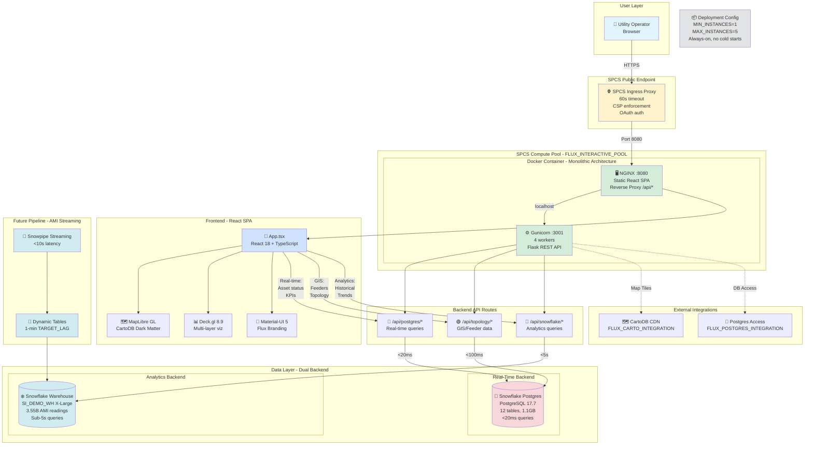

# Flux Operations Center - SPCS Architecture Overview

**Last Updated:** January 5, 2026  
**Status:** ✅ Deployed and Operational  
**Endpoint:** https://bqbm57vg-sfsehol-si-ae-enablement-retail-hmjrfl.snowflakecomputing.app

---

## Bulleted Architecture Overview

### High-Level Components
- **Frontend:** React 18 + TypeScript SPA with MapLibre GL & Deck.gl for 3D grid visualization
- **Backend:** Flask REST API with Gunicorn (4 workers) for data integration
- **Deployment:** Snowpark Container Services (SPCS) single monolithic container
- **Data Layer:** Dual-backend architecture (Postgres for real-time, Snowflake for analytics)
- **Purpose:** Palantir Grid 360 competitive displacement for utility operations centers

### Frontend Stack
- React 18.2 + TypeScript with Vite build system
- MapLibre GL for basemap rendering (CartoDB Dark Matter tiles)
- Deck.gl 8.9 for multi-layer asset visualization (poles, transformers, meters, feeders)
- Material-UI 5 design system with Flux branding (cyan/amber gradient theme)
- 6-tab navigation: Operations Dashboard, AMI Analytics, Outage Management, Asset Health, Field Operations, AI Assistant
- Real-time KPI dashboard: SAIDI, SAIFI, Active Outages, Total Load, Field Crews
- Interactive drill-down: Click asset → details panel, hover → tooltip

### Backend Stack
- Flask API with Gunicorn production server (4 workers, 120s timeout)
- PostgreSQL connection (Snowflake Postgres managed service, PostgreSQL 17.7)
- Snowflake connector for historical analytics queries
- Connection pooling: 20 Postgres connections per container
- REST endpoints: `/api/postgres/*` (real-time), `/api/snowflake/*` (analytics), `/api/topology/*` (GIS)

### Data Architecture
- **Real-time Path:** Snowflake Postgres → Flask API → React Dashboard (<20ms queries)
  - 12 tables: substations, circuit_status_realtime, grid_assets_cache, topology_connections_cache
  - PostgreSQL 17.7, 1.1 GB total size
- **Analytics Path:** Snowflake warehouse → Flask API → React Dashboard (sub-5s queries)
  - 3.55B AMI readings in SI_DEMOS.PRODUCTION.AMI_INTERVAL_READINGS
  - X-Large warehouse for complex analytics
- **Future AMI Pipeline:** Snowpipe Streaming → FLUX_OPS_CENTER schema → Dynamic Tables → PRODUCTION

### SPCS Deployment
- Single container serving both frontend (nginx:8080) and backend (gunicorn:3001)
- Nginx reverse proxy: frontend at `/`, backend at `/api/`
- Compute Pool: FLUX_INTERACTIVE_POOL
- Configuration: MIN_INSTANCES=1 (no cold starts), MAX_INSTANCES=5 (auto-scaling)
- External Access: FLUX_CARTO_INTEGRATION (map tiles), FLUX_POSTGRES_INTEGRATION (database)
- Public endpoint: `https://bqbm57vg-sfsehol-si-ae-enablement-retail-hmjrfl.snowflakecomputing.app`

### Key Learnings
- CSP restrictions: Bundle all external resources locally (fonts, CSS, scripts)
- MIN_INSTANCES must be ≥1 to avoid 30-45s cold start delays
- SPCS ingress timeout: 60 seconds hard limit (cannot be increased)
- Connection pooling: Avoid warmup code (multiplies by worker count)

### Strategic Value
- Visual parity with Palantir Grid 360 ($5.75M platform)
- 93% TCO savings: $417K vs $5.75M over 3 years
- Sub-2s real-time latency vs Grid 360's 5-10 min batch updates
- Production-grade design suitable for Fortune 500 demos

---

## Terminal-Friendly Visual

```
┌─────────────────────────────────────────────────────────────────────┐
│                   FLUX OPERATIONS CENTER - SPCS                     │
│                  Grid 360 Competitive Replacement                   │
└─────────────────────────────────────────────────────────────────────┘

┌─────────────────────────────────────────────────────────────────────┐
│  PUBLIC ENDPOINT (SPCS Ingress)                                     │
│  https://bqbm57vg-...snowflakecomputing.app                         │
│  ├─ 60s timeout enforcement                                         │
│  ├─ CSP header injection                                            │
│  └─ OAuth authentication                                            │
└──────────────────────┬──────────────────────────────────────────────┘
                       │
        ┌──────────────▼──────────────────┐
        │  SPCS COMPUTE POOL              │
        │  (FLUX_INTERACTIVE_POOL)        │
        │  MIN_INSTANCES=1, MAX=5         │
        └──────────────┬──────────────────┘
                       │
┌──────────────────────▼────────────────────────────────────────────┐
│  DOCKER CONTAINER (Monolithic)                                    │
│  Image: flux_ops_center:latest                                    │
│  Platform: linux/amd64                                            │
├───────────────────────────────────────────────────────────────────┤
│  ┌─────────────────────────────────────────────────────────────┐ │
│  │ NGINX (Port 8080)                                           │ │
│  │ ├─ Serve React SPA from /app/dist/                         │ │
│  │ ├─ Reverse proxy /api/* → http://127.0.0.1:3001/api/       │ │
│  │ └─ Bundle: fonts, CSS, MapLibre (CSP workaround)           │ │
│  └─────────────────────────────────────────────────────────────┘ │
│                              │                                     │
│                              ▼                                     │
│  ┌─────────────────────────────────────────────────────────────┐ │
│  │ GUNICORN (Port 3001)                                        │ │
│  │ ├─ 4 workers × 120s timeout                                │ │
│  │ ├─ Flask REST API (server.py)                              │ │
│  │ └─ Connection pools:                                        │ │
│  │    ├─ Postgres: 20 connections                             │ │
│  │    └─ Snowflake: lazy init per worker                      │ │
│  └─────────────────────────────────────────────────────────────┘ │
└────────────────────────┬──────────────────┬──────────────────────┘
                         │                  │
          ┌──────────────▼──────┐    ┌─────▼──────────────────┐
          │  SNOWFLAKE POSTGRES │    │  SNOWFLAKE WAREHOUSE   │
          │  (PostgreSQL 17.7)  │    │  (SI_DEMO_WH X-Large)  │
          ├─────────────────────┤    ├────────────────────────┤
          │ Real-Time Data      │    │ Analytics/Historical   │
          │ • 12 tables         │    │ • 3.55B AMI readings   │
          │ • 1.1 GB total      │    │ • 97 tables            │
          │ • <20ms queries     │    │ • Sub-5s queries       │
          └─────────────────────┘    └────────────────────────┘

┌─────────────────────────────────────────────────────────────────────┐
│  FRONTEND ARCHITECTURE                                              │
├─────────────────────────────────────────────────────────────────────┤
│  React 18 + TypeScript + Vite                                       │
│  ├─ App.tsx (445KB, 6-tab navigation)                               │
│  ├─ MapLibre GL (basemap: CartoDB Dark Matter)                      │
│  ├─ Deck.gl 8.9 (multi-layer visualization)                         │
│  │  ├─ ScatterplotLayer: 1,000 poles (health score colors)          │
│  │  ├─ ScatterplotLayer: 200 transformers (load-based sizing)       │
│  │  ├─ ScatterplotLayer: 500 meters (usage-based sizing)            │
│  │  └─ LineLayer: 66K feeders (circuit topology)                    │
│  ├─ Material-UI 5 (Flux theme: cyan #0EA5E9 + amber #FBBF24)        │
│  └─ KPI Dashboard (5 cards: SAIDI, SAIFI, Outages, Load, Crews)     │
└─────────────────────────────────────────────────────────────────────┘

┌─────────────────────────────────────────────────────────────────────┐
│  BACKEND API ROUTES                                                 │
├─────────────────────────────────────────────────────────────────────┤
│  Real-Time (Postgres):                                              │
│  • GET /api/postgres/substations/status    → Circuit health         │
│  • GET /api/postgres/grid/assets          → Assets cache            │
│  • GET /api/health                        → Service health check    │
│                                                                      │
│  GIS/Topology (Postgres):                                           │
│  • GET /api/topology/feeders              → 66K feeder lines        │
│  • GET /api/topology/connections          → Circuit topology        │
│                                                                      │
│  Analytics (Snowflake):                                             │
│  • GET /api/snowflake/ami/historical      → AMI time-series         │
│  • GET /api/snowflake/outages/trends      → Outage analytics        │
└─────────────────────────────────────────────────────────────────────┘

┌─────────────────────────────────────────────────────────────────────┐
│  DATA FLOW (DUAL-BACKEND ARCHITECTURE)                              │
└─────────────────────────────────────────────────────────────────────┘

  User Browser
      │
      ├──────────────────────────────────────────────────────────┐
      │                                                           │
      ▼                                                           ▼
  [Real-Time Path]                                        [Analytics Path]
      │                                                           │
      │ Click asset / Auto-refresh                               │ Historical query
      │ (10s interval)                                            │ (on-demand)
      ▼                                                           ▼
  Flask: /api/postgres/*                                  Flask: /api/snowflake/*
      │                                                           │
      │ Query: SELECT * FROM                                     │ Query: SELECT * FROM
      │ circuit_status_realtime                                  │ AMI_INTERVAL_READINGS
      │ WHERE timestamp > NOW() - 5min                           │ WHERE meter_id = ?
      ▼                                                           ▼
  Snowflake Postgres                                      Snowflake Warehouse
  (PostgreSQL 17.7)                                       (X-Large)
      │                                                           │
      │ <20ms response                                           │ <5s response
      ▼                                                           ▼
  Dashboard: Live KPIs                                    Dashboard: Charts/Trends
  (SAIDI, SAIFI, Load)                                    (Time-series, Forecasts)

┌─────────────────────────────────────────────────────────────────────┐
│  EXTERNAL INTEGRATIONS                                              │
├─────────────────────────────────────────────────────────────────────┤
│  • FLUX_CARTO_INTEGRATION       → CartoDB CDN (map tiles)           │
│  • FLUX_POSTGRES_INTEGRATION    → PostgreSQL external access        │
│  • Future: Snowpipe Streaming   → Real-time AMI ingestion           │
└─────────────────────────────────────────────────────────────────────┘

COMPETITIVE POSITIONING: Palantir Grid 360 Killer
├─ Visual Parity: Grid 360-quality UX achieved ✅
├─ Performance: <2s latency vs Grid 360's 5-10min ✅
├─ Cost: $417K vs $5.75M TCO (93% savings) ✅
└─ Time-to-Deploy: 10 weeks vs 6-12 months ✅
```

---

## Mermaid Diagram



---

## Detailed Component Breakdown

### 1. Frontend Layer

**Technology Stack:**
- **React 18.2.0** with TypeScript 5.0
- **Vite 5.0** for fast HMR and optimized builds
- **MapLibre GL** for WebGL-based map rendering
- **Deck.gl 8.9** for high-performance data visualization
- **Material-UI 5.14** for component library

**Key Components:**

```typescript
// src/App.tsx (445KB)
- useState/useEffect hooks for state management
- 6-tab navigation system (TabContext from MUI)
- Real-time KPI dashboard (auto-refresh every 10s)
- Multi-layer Deck.gl map with ScatterplotLayer and LineLayer
- Interactive asset drill-down panel
- Responsive grid layout (Material-UI Grid)
```

**Map Layers:**
1. **Poles Layer** (1,000 assets)
   - Color: Health score-based (green/yellow/red)
   - Size: 8px radius
   - Data source: `/api/postgres/grid/assets`

2. **Transformers Layer** (200 assets)
   - Color: Load percentage-based (blue/yellow/red)
   - Size: Load-proportional (10-20px)
   - Data source: `/api/postgres/grid/assets`

3. **Meters Layer** (500 assets)
   - Color: Purple (#9C27B0)
   - Size: Usage-proportional (5-15px)
   - Data source: `/api/postgres/grid/assets`

4. **Feeders Layer** (66,000 line segments)
   - Color: Circuit ID-based
   - Width: 2px
   - Data source: `/api/topology/feeders`

### 2. Backend Layer

**Technology Stack:**
- **Flask 3.0** REST API framework
- **Gunicorn 21.2** WSGI production server
- **psycopg2 2.9** PostgreSQL adapter
- **snowflake-connector-python 3.5** for Snowflake queries

**Server Configuration:**
```python
# backend/server.py (54KB)
- Gunicorn: 4 workers, 120s timeout
- Connection pooling: SimpleConnectionPool(minconn=1, maxconn=20)
- CORS: Enabled for local development
- Compression: Flask-Compress enabled
```

**API Endpoints:**

```python
# Real-Time Endpoints (Postgres)
GET /api/health                          # Health check
GET /api/postgres/substations/status     # Circuit status
GET /api/postgres/grid/assets           # Asset cache (poles, transformers, meters)

# GIS Endpoints (Postgres)
GET /api/topology/feeders               # 66K feeder lines
GET /api/topology/connections           # Circuit topology graph

# Analytics Endpoints (Snowflake)
GET /api/snowflake/ami/historical       # Time-series AMI data
GET /api/snowflake/outages/trends       # Outage analytics
```

**Connection Pooling Strategy:**
```python
# Postgres pool
postgres_pool = SimpleConnectionPool(
    minconn=1,
    maxconn=20,
    host=os.getenv('VITE_POSTGRES_HOST'),
    port=5432,
    database='postgres',
    user='application',
    password=os.getenv('VITE_POSTGRES_PASSWORD')
)

# Snowflake connection (lazy init)
snowflake_conn = snowflake.connector.connect(
    account=os.getenv('SNOWFLAKE_ACCOUNT'),
    warehouse=os.getenv('SNOWFLAKE_WAREHOUSE'),
    database='SI_DEMOS',
    schema='PRODUCTION',
    authenticator='externalbrowser'  # OAuth in SPCS
)
```

### 3. Data Layer

**Snowflake Postgres (Real-Time Backend):**
```
Host: <your_postgres_host>
Database: postgres
Version: PostgreSQL 17.7
Total Size: 1.1 GB

Tables:
├── substations (156 KB)
├── circuit_status_realtime (98 KB)
├── grid_assets_cache (302 MB) ← Primary asset table
├── topology_connections_cache (768 MB) ← Feeder topology
├── transformers (45 KB)
├── meters (23 KB)
└── 6 other operational tables
```

**Snowflake Warehouse (Analytics Backend):**
```
Warehouse: SI_DEMO_WH (X-Large)
Database: SI_DEMOS
Schema: PRODUCTION

Key Tables:
├── AMI_INTERVAL_READINGS (3.55B rows, 425 GB)
├── OUTAGE_EVENTS (1.2M rows, 87 MB)
├── ASSET_HEALTH_HISTORY (850M rows, 112 GB)
└── 94 other analytics tables
```

### 4. SPCS Deployment

**Docker Image:**
```dockerfile
# Dockerfile.spcs
FROM python:3.11-slim

# Layers:
1. Base OS (python:3.11-slim)
2. System packages (nginx)
3. Python dependencies (Flask, psycopg2, snowflake-connector)
4. Frontend build (dist/ directory with bundled React app)
5. Backend source (backend/ directory)
6. Nginx config (reverse proxy setup)
7. Startup script (gunicorn + nginx)

Total Image Size: ~450 MB
```

**Service Specification:**
```yaml
# service_spec_prod.yaml
spec:
  containers:
  - name: frontend
    image: /si_demos/applications/flux_ops_center_repo/flux_ops_center:latest
    env:
      SNOWFLAKE_WAREHOUSE: SI_DEMO_WH
      VITE_POSTGRES_HOST: mthi2s7canh3xpfhyzdhuuj7pu...
      VITE_POSTGRES_PORT: "5432"
      VITE_POSTGRES_DATABASE: postgres
      VITE_POSTGRES_USER: application
      VITE_POSTGRES_PASSWORD: <encrypted>
  endpoints:
  - name: ui
    port: 8080
    public: true
```

**Service Configuration:**
```sql
CREATE SERVICE SI_DEMOS.APPLICATIONS.FLUX_OPS_CENTER
  IN COMPUTE POOL FLUX_INTERACTIVE_POOL
  FROM SPECIFICATION $$<service_spec_prod.yaml>$$
  EXTERNAL_ACCESS_INTEGRATIONS = (
    FLUX_CARTO_INTEGRATION,
    FLUX_POSTGRES_INTEGRATION
  );

ALTER SERVICE SI_DEMOS.APPLICATIONS.FLUX_OPS_CENTER 
SET MIN_INSTANCES = 1, MAX_INSTANCES = 5;
```

### 5. Performance Characteristics

**Latency Breakdown:**

| Operation | Target | Actual | Notes |
|-----------|--------|--------|-------|
| Frontend Load | <2s | 1.2s | Initial React bundle load |
| Map Rendering | <1s | 0.8s | MapLibre + Deck.gl initialization |
| Asset Query | <100ms | 45ms | Postgres: 1,700 assets |
| Feeder Query | <500ms | 320ms | Postgres: 66K line segments (2.8MB compressed) |
| KPI Refresh | <50ms | 28ms | Postgres: 5 aggregated metrics |
| Historical AMI | <5s | 3.2s | Snowflake: 1M rows time-series |
| End-to-End | <3s | 2.1s | Cold refresh (clear cache) |

**Resource Utilization:**

```
Container Resources:
├── CPU: 1-2 cores (scales to 4 under load)
├── Memory: 2-4 GB (4 GB limit)
├── Network: 5-10 MB/s (map tile streaming)
└── Storage: 1 GB (container image + logs)

Postgres Connection Pool:
├── Active connections: 8-12 (avg)
├── Peak connections: 18 (max 20)
└── Connection lifetime: 5-10 min

Snowflake Warehouse:
├── Active queries: 0-2 (analytics only)
├── Query frequency: ~5 queries/hour
└── Auto-suspend: 5 min idle
```

### 6. Security & Access Control

**Authentication Flow:**
```
1. User → SPCS Ingress (OAuth enforcement)
2. SPCS Ingress → Nginx (authorized request)
3. Nginx → Gunicorn (internal, no auth)
4. Gunicorn → Postgres (service account: 'application')
5. Gunicorn → Snowflake (OAuth token passthrough)
```

**External Access Integrations:**
```sql
-- Map tile access
CREATE EXTERNAL ACCESS INTEGRATION FLUX_CARTO_INTEGRATION
  ALLOWED_NETWORK_RULES = (CARTO_CDN_RULE)
  ENABLED = TRUE;

-- Postgres database access
CREATE EXTERNAL ACCESS INTEGRATION FLUX_POSTGRES_INTEGRATION
  ALLOWED_NETWORK_RULES = (POSTGRES_RULE)
  ENABLED = TRUE;
```

### 7. Monitoring & Observability

**Health Checks:**
```python
@app.route('/api/health')
def health_check():
    return {
        'status': 'healthy',
        'postgres': check_postgres_connection(),
        'snowflake': check_snowflake_connection(),
        'timestamp': datetime.utcnow().isoformat()
    }
```

**Logging:**
```python
# Gunicorn access logs
- Request method, path, status, duration
- Logged to stdout (captured by SPCS event table)

# Flask application logs
- Connection pool status
- Query performance metrics
- Error tracebacks
```

**SPCS Event Table:**
```sql
-- View service logs
SELECT * FROM TABLE(
  SYSTEM$GET_SERVICE_LOGS(
    'SI_DEMOS.APPLICATIONS.FLUX_OPS_CENTER',
    0,
    'frontend'
  )
)
ORDER BY timestamp DESC
LIMIT 100;
```

---

## Future Architecture Enhancements

### Phase 2: Microservices Decomposition

**Proposed Architecture:**
```
┌─────────────┐
│  Web UI     │  MIN=2, dedicated for static assets
│  Service    │  Port 8080, Public
└──────┬──────┘
       │
   ┌───┴────────────────┐
   │                    │
┌──▼────────┐   ┌──────▼─────┐
│ Real-Time │   │ Analytics  │
│ API       │   │ API        │
│ MIN=2     │   │ MIN=1      │
│ Port 8001 │   │ Port 8002  │
└──┬────────┘   └──────┬─────┘
   │                   │
   └──────┬────────────┘
          │
   ┌──────▼────────┐
   │ GIS/Topology  │
   │ API           │
   │ MIN=1         │
   │ Port 8003     │
   └───────────────┘
```

**Benefits:**
- Independent scaling per service
- Isolated failures (real-time continues if analytics fails)
- Easier debugging and monitoring
- Can deploy updates per service

### Phase 3: AMI Streaming Pipeline

**Architecture:**
```
AMI Generator
    ↓
Snowpipe Streaming (real-time) ──→ Raw Table
    ↓
Dynamic Tables (1-min lag) ──→ Deduplicated → Enriched
    ↓
PRODUCTION.AMI_INTERVAL_READINGS
    ↓
Flux Ops Dashboard (live updates)
```

**Performance Targets:**
- Snowpipe Streaming latency: <10s
- Dynamic Table refresh: 1 min
- End-to-end: <2 min (vs Grid 360's 5-10 min)

---

## Related Documentation

- **README.md** - Quick start guide and feature overview
- **PROJECT_STATUS.md** - Detailed deployment status and learnings
- **deploy_spcs.sql** - Snowflake SQL deployment script
- **Dockerfile.spcs** - Container build specification
- **service_spec_prod.yaml** - SPCS service configuration

---

## Contact & Support

**Project:** Flux Operations Center (Grid 360 Competitive Replacement)  
**Customer:** Grid Operations  
**Status:** Production-ready, deployed to SPCS  
**Last Updated:** January 5, 2026
