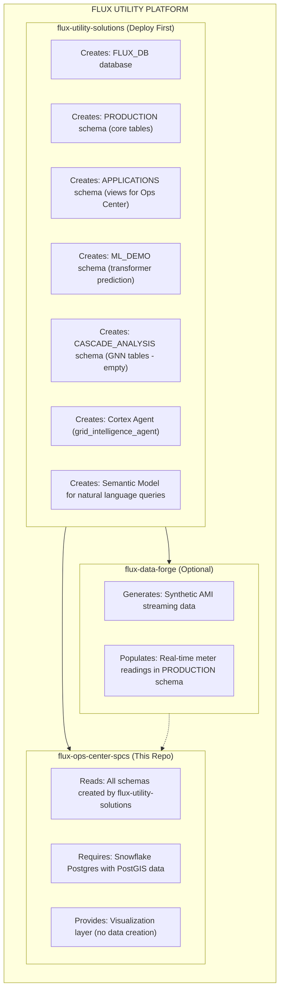
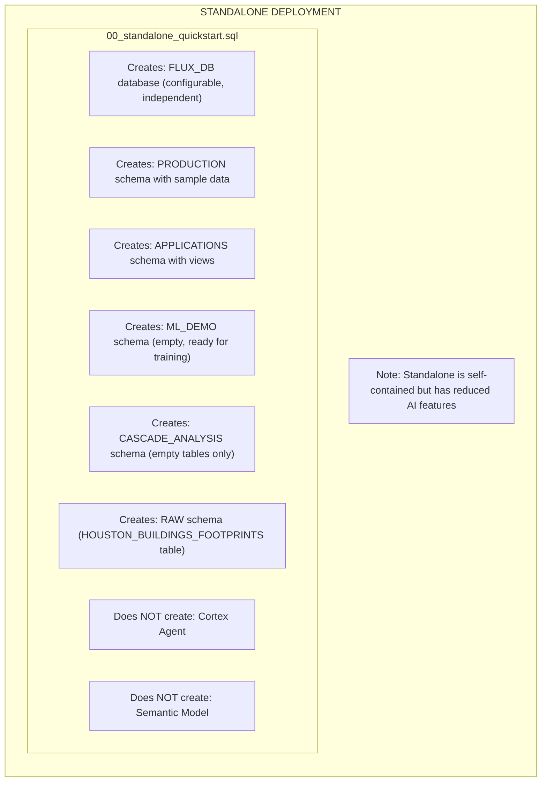
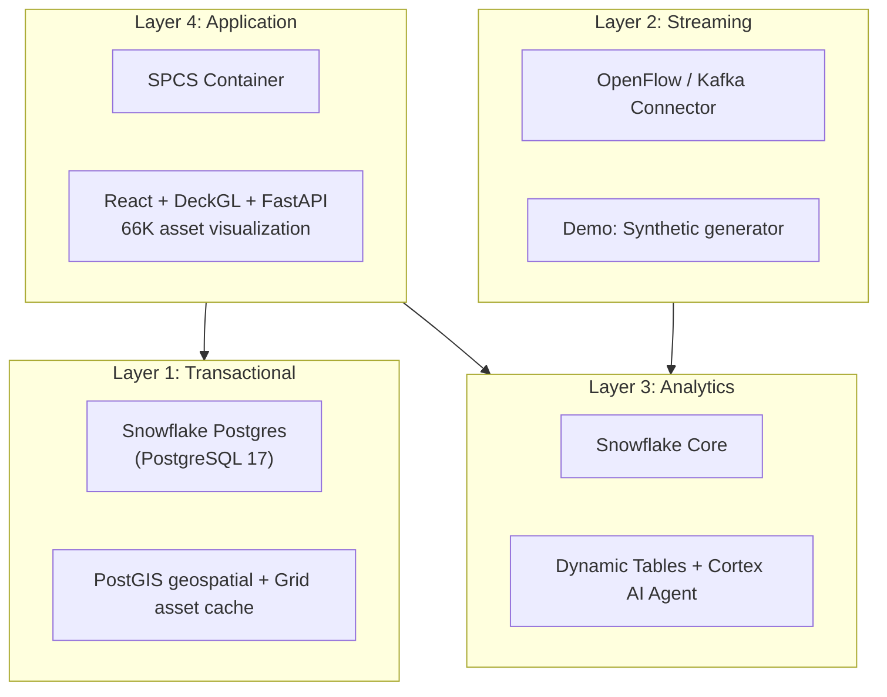

# Flux Operations Center

[](https://www.snowflake.com)
[](LICENSE)

**Real-time utility grid visualization and GNN-based cascade failure prediction on Snowflake.**

<p align="center">
  
  
</p>

---

## TL;DR - Get Started in 3 Commands

```bash
git clone https://github.com/sfc-gh-abannerjee/flux-ops-center-spcs.git
cd flux_ops_center_spcs
snow sql -c your_connection -f scripts/sql/00_standalone_quickstart.sql  # Creates database + sample data
./scripts/quickstart.sh  # Deploys SPCS service (interactive)
```

Then load PostGIS data: `python backend/scripts/load_postgis_data.py --service your_pg_service`

---

## Table of Contents

- [Choose Your Deployment Path](#choose-your-deployment-path)
- [Standalone Quick Start](#standalone-quick-start-fastest) ⭐ Recommended for first-time users
- [Integrated Deployment](#integrated-deployment-full-platform)
- [PostGIS Spatial Data Setup](#postgis-spatial-data-setup-required) ⚠️ Required for map
- [Local Development](#local-development)
- [Features](#features)
- [Dependencies & Feature Availability](#dependencies--feature-availability)
- [Architecture](#architecture)
- [Troubleshooting](#troubleshooting)

---

## Flux Utility Platform

Flux Operations Center is part of a suite of Snowflake solutions:

| Repository | Purpose | Deploy Order |
|------------|---------|--------------|
| [**Flux Utility Solutions**](https://github.com/sfc-gh-abannerjee/flux-utility-solutions) | Core platform - database, Cortex AI, semantic models | 1st (if using integrated path) |
| [Flux Data Forge](https://github.com/sfc-gh-abannerjee/flux-data-forge) | Synthetic AMI data generation | Optional |
| **Flux Ops Center** (this repo) | Real-time grid visualization | 2nd (or standalone) |

---

## Choose Your Deployment Path

Flux Operations Center can be deployed in two ways. **Pick the one that matches your needs:**

| Path | Best For | Time to Deploy | What You Get |
|------|----------|----------------|--------------|
| **[Standalone Quick Start](#standalone-quick-start-fastest)** | Quick demos, trying it out, independent use | ~15 minutes | Self-contained database with sample data |
| **[Integrated with Flux Platform](#integrated-deployment-full-platform)** | Full utility platform, multi-repo architecture | ~30-45 minutes | Shared data model across all Flux apps |

**Not sure which to pick?** Start with the Standalone Quick Start - you can always migrate to the full platform later.

---

## Standalone Quick Start (Fastest)

**No other repositories required.** This option creates everything you need in a single SQL script.

### Prerequisites

- Snowflake account with `ACCOUNTADMIN` role (or equivalent)
- [Snowflake CLI (Snow CLI)](https://docs.snowflake.com/en/developer-guide/snowflake-cli/installation/installation) installed and configured
- Docker Desktop installed and running

<br/>

### Step 1: Set Up Your Snowflake CLI Connection

If you haven't already configured the Snowflake CLI, run:

```bash
snow connection add
```

This will prompt you for:
- **Connection name**: A name for your connection (e.g., `my_flux_demo`)
- **Account**: Your Snowflake account identifier (e.g., `abc12345.us-east-1`)
- **User**: Your Snowflake username
- **Authentication**: Choose password, SSO, or key-pair

Test your connection:

```bash
snow connection test -c my_flux_demo
```

### Step 2: Run the Standalone Setup Script

```bash
# Clone this repository
git clone https://github.com/sfc-gh-abannerjee/flux_ops_center_spcs.git
cd flux_ops_center_spcs

# Run the standalone setup (creates database, tables, sample data)
snow sql -c my_flux_demo -f scripts/sql/00_standalone_quickstart.sql
```

**What this creates:**

- `FLUX_DB` database with all required schemas (configurable in the script)
- Core tables: substations, transformers, circuits, meters
- Application views: grid topology, KPIs, service areas
- ML tables: graph structure, cascade analysis
- Sample data: 25 substations, 200 transformers, 50 circuits, 500 meters

<br/>

### Step 3: Deploy the Application

```bash
# Run the interactive deployment script
./scripts/quickstart.sh
```

The script will guide you through:

1. Validating your environment (Docker, credentials)
2. Building the Docker image
3. Pushing to Snowflake's image registry
4. Creating a compute pool
5. Deploying the SPCS service
6. Setting up Snowflake Postgres (optional but recommended)

<br/>

### Step 4: Load PostGIS Spatial Data

**Required for map visualization.** After Postgres is set up:

```bash
# Load all 10 spatial layers (~390MB) from GitHub Releases
python backend/scripts/load_postgis_data.py --service your_pg_service
```

See [PostGIS Spatial Data Setup](#postgis-spatial-data-setup-required) for details.

Once complete, you'll get a URL to access your Flux Operations Center.

---

## Integrated Deployment (Full Platform)

**Use this if you want the complete Flux Utility Platform** with shared data across multiple applications.

### The Flux Utility Platform

Flux Operations Center is part of a suite of Snowflake solutions:

| Repository | Purpose | When to Use |
|------------|---------|-------------|
| [Flux Utility Solutions](https://github.com/sfc-gh-abannerjee/flux-utility-solutions) | Core platform with Cortex AI, semantic models | Building a complete utility demo |
| [Flux Data Forge](https://github.com/sfc-gh-abannerjee/flux-data-forge) | Synthetic AMI data generation with streaming | Need realistic test data at scale |
| **Flux Ops Center** (this repo) | Real-time grid visualization, GNN risk prediction | Need interactive grid maps |

### Prerequisites

- Snowflake account with `ACCOUNTADMIN` role
- [Snowflake CLI](https://docs.snowflake.com/en/developer-guide/snowflake-cli/installation/installation) installed
- Docker Desktop installed

### Step 1: Deploy Flux Utility Solutions First

```bash
# Clone the core platform
git clone https://github.com/sfc-gh-abannerjee/flux-utility-solutions.git
cd flux-utility-solutions

# Run the quickstart (interactive prompts)
./cli/quickstart.sh --database FLUX_DB --connection my_flux_demo
```

This creates the shared `FLUX_DB` database with:

- `PRODUCTION` schema: Core tables (substations, transformers, meters, circuits)
- `APPLICATIONS` schema: Ops Center views (topology, KPIs, service areas)
- `ML_DEMO` schema: Grid graph and transformer prediction tables
- `CASCADE_ANALYSIS` schema: GNN cascade analysis tables

<br/>

### Step 2: Deploy Flux Ops Center

```bash
# Navigate to this repository
cd ../flux_ops_center_spcs

# Run the deployment script
./scripts/quickstart.sh
```

<br/>

### Step 3: Load PostGIS Spatial Data

**Required for map visualization.** After Postgres is set up:

```bash
python backend/scripts/load_postgis_data.py --service your_pg_service
```

### Understanding the SQL Scripts (For Manual Deployment)

The SQL scripts in `scripts/sql/` use **Jinja2 templating** - a way to make scripts configurable without editing the SQL directly.

**What is Jinja2 templating?**

Instead of hardcoding values like database names, we use placeholders:

```sql
-- In the SQL file, you'll see:
USE DATABASE <% database %>;
CREATE SCHEMA <% database %>.<% schema %>;

-- When you run with Snow CLI, you provide the values:
snow sql -f script.sql -D "database=FLUX_DB" -D "schema=PUBLIC"

-- The CLI replaces the placeholders with your values before executing
```

**The `-D` flag** passes variables to the script. Common variables you'll see:

| Variable | What It Means | Example Value |
|----------|---------------|---------------|
| `database` | Target database name | `FLUX_DB` |
| `schema` | Target schema name | `PUBLIC` |
| `warehouse` | Compute warehouse | `FLUX_WH` |
| `admin_role` | Role for admin operations | `ACCOUNTADMIN` |
| `user_role` | Role for general access | `PUBLIC` |

**Example: Running a script with variables**

```bash
# This command:
snow sql -c my_flux_demo -f scripts/sql/01_image_repository.sql \
    -D "database=FLUX_DB" \
    -D "schema=PUBLIC" \
    -D "image_repo=FLUX_OPS_CENTER_IMAGES"

# Is equivalent to running this SQL:
USE DATABASE FLUX_DB;
CREATE IMAGE REPOSITORY IF NOT EXISTS FLUX_DB.PUBLIC.FLUX_OPS_CENTER_IMAGES;
```

### Manual SQL Deployment Steps

If you prefer step-by-step control instead of the quickstart script:

```bash
# Set your connection name
export CONN="my_flux_demo"

# 1. Create image repository
snow sql -c $CONN -f scripts/sql/01_image_repository.sql \
    -D "database=FLUX_DB" -D "schema=PUBLIC" \
    -D "image_repo=FLUX_OPS_CENTER_IMAGES"

# 2. Build and push Docker image
docker build -f Dockerfile.spcs -t flux-ops-center:latest .
# (See scripts/sql/README.md for push instructions)

# 3. Create compute pool
snow sql -c $CONN -f scripts/sql/02_compute_pool.sql \
    -D "database=FLUX_DB" -D "compute_pool=FLUX_OPS_CENTER_POOL" \
    -D "instance_family=CPU_X64_S" -D "min_nodes=1" -D "max_nodes=2"

# 4. Set up Snowflake Postgres (dual-backend architecture)
snow sql -c $CONN -f scripts/sql/05_postgres_setup.sql \
    -D "database=FLUX_DB" -D "warehouse=FLUX_WH" \
    -D "postgres_instance=FLUX_OPS_POSTGRES" \
    -D "postgres_compute=HIGHMEM_XL" \
    -D "postgres_storage_gb=100" -D "postgres_version=17"
# IMPORTANT: Save the credentials shown - they cannot be retrieved later!

# 5. Get Postgres host (needed for next steps)
# Run: SHOW POSTGRES INSTANCES LIKE 'FLUX_OPS_POSTGRES';
# Copy the 'host' value (e.g., abc123.us-west-2.aws.postgres.snowflake.app)

# 6. Create external access integration for Postgres sync procedures
snow sql -c $CONN -f scripts/sql/05a_external_access.sql \
    -D "database=FLUX_DB" -D "schema=APPLICATIONS" \
    -D "postgres_host=<host_from_step_5>" \
    -D "postgres_user=application" \
    -D "postgres_password=<password_from_step_4>" \
    -D "integration_name=FLUX_POSTGRES_INTEGRATION"

# 7. Deploy SPCS service (with Postgres config)
snow sql -c $CONN -f scripts/sql/03_create_service.sql \
    -D "database=FLUX_DB" -D "schema=PUBLIC" \
    -D "service_name=FLUX_OPS_CENTER_SERVICE" \
    -D "compute_pool=FLUX_OPS_CENTER_POOL" \
    -D "image_repo=FLUX_OPS_CENTER_IMAGES" \
    -D "image_tag=latest" -D "warehouse=FLUX_WH" \
    -D "postgres_host=<host_from_step_5>"

# 8. Load PostGIS spatial data (REQUIRED for map visualization)
python backend/scripts/load_postgis_data.py --service flux_ops_postgres

# 9. (Optional) Set up dynamic data sync procedures
snow sql -c $CONN -f scripts/sql/06_postgres_sync.sql \
    -D "database=FLUX_DB" -D "warehouse=FLUX_WH" \
    -D "postgres_host=<host_from_step_5>" \
    -D "postgres_secret=FLUX_DB.APPLICATIONS.POSTGRES_CREDENTIALS" \
    -D "postgres_integration=FLUX_POSTGRES_INTEGRATION"

# 10. Validate deployment
snow sql -c $CONN -f scripts/sql/04_validation.sql \
    -D "database=FLUX_DB" \
    -D "service_name=FLUX_OPS_CENTER_SERVICE" \
    -D "compute_pool=FLUX_OPS_CENTER_POOL" \
    -D "image_repo=FLUX_OPS_CENTER_IMAGES"
```

---

## Other Deployment Options

> **One solution. Five ways to build.** Matching the deployment paths in [flux-utility-solutions](https://github.com/sfc-gh-abannerjee/flux-utility-solutions).

| Path | Best For | Guide |
|------|----------|-------|
| **CLI Quick Start** | Demos, POCs, fastest setup | `./scripts/quickstart.sh` |
| **SQL Scripts** | Learning, auditing, step-by-step control | [scripts/sql/](./scripts/sql/) |
| **Notebooks** | Workshops, data science teams | [notebooks/](./notebooks/) |
| **Git Integration** | GitOps, CI/CD pipelines | [git_deploy/](./git_deploy/) |
| **Terraform** | Enterprise IaC, multi-environment | [terraform/](./terraform/) |

### Using Pre-Built Docker Images

**Skip the build step entirely.** Pre-built images are published to GitHub Container Registry on every release.

```bash
# Pull the latest pre-built image
docker pull ghcr.io/sfc-gh-abannerjee/flux-ops-center-spcs:latest

# Or pull a specific version
docker pull ghcr.io/sfc-gh-abannerjee/flux-ops-center-spcs:v1.0.0

# Tag for your Snowflake image repository
docker tag ghcr.io/sfc-gh-abannerjee/flux-ops-center-spcs:latest \
    <your-account>.registry.snowflakecomputing.com/FLUX_DB/PUBLIC/FLUX_OPS_CENTER_IMAGES/flux-ops-center:latest

# Push to Snowflake
docker push <your-account>.registry.snowflakecomputing.com/FLUX_DB/PUBLIC/FLUX_OPS_CENTER_IMAGES/flux-ops-center:latest
```

**Available tags:**
- `latest` - Most recent build from main branch
- `v1.x.x` - Semantic versioned releases
- `main` - Latest commit on main branch
- `sha-xxxxxxx` - Specific commit builds

**Multi-architecture support:** Images are built for both `linux/amd64` and `linux/arm64`.

### Terraform Deployment

```bash
cd terraform
cp terraform.tfvars.example terraform.tfvars
# Edit terraform.tfvars with your values
terraform init
terraform apply
```

---

## PostGIS Spatial Data Setup (Required)

**All deployment paths require loading PostGIS spatial data for full map functionality.**

The map visualization requires 10 spatial layers (~390MB compressed) stored in Snowflake Postgres with PostGIS. These layers contain polygon geometries (building footprints, water bodies) that are pre-processed and ready to load.

### Option A: Download from GitHub Releases (Recommended)

```bash
# The load script downloads data automatically from GitHub Releases
python backend/scripts/load_postgis_data.py --service your_pg_service
```

### Option B: Use Local Data Files

If you already have the data files:

```bash
python backend/scripts/load_postgis_data.py \
    --service your_pg_service \
    --local-data ./data/postgis_exports
```

### What Gets Loaded

| Layer | Rows | Description |
|-------|------|-------------|
| building_footprints | 2.67M | Building polygons with heights |
| grid_assets_cache | 726K | Unified asset cache for deck.gl |
| osm_water | 12.7K | Water bodies (rivers, lakes) |
| grid_power_lines | 13K | Power line geometries |
| vegetation_risk | 49K | Vegetation near power lines |
| substations | 275 | Substation locations |
| transformers | 91K | Transformer records |
| customers_spatial | 100K | Customer locations |
| meter_locations_enhanced | 100K | Smart meter locations |
| topology_connections_cache | 153K | Network topology |

See [data/postgis_exports/README.md](./data/postgis_exports/README.md) for detailed instructions.

---

## Local Development

Want to run Flux Operations Center on your local machine for development?

### Prerequisites

- Python 3.11+
- Node.js 18+
- Snowflake CLI with a configured connection
- Snowflake Postgres instance with PostGIS data loaded (see above)

### Setup

```bash
# Install dependencies
pip install -r backend/requirements.txt
npm install

# Copy environment template
cp .env.example .env
# Edit .env with your Snowflake and Postgres credentials
```

### Running Locally

```bash
# Terminal 1 - Backend (FastAPI)
SNOWFLAKE_CONNECTION_NAME=my_flux_demo uvicorn backend.server_fastapi:app --host 0.0.0.0 --port 3001 --reload

# Terminal 2 - Frontend (Vite)
npm run dev
```

| Service | URL |
|---------|-----|
| Frontend | http://localhost:5173 |
| Backend API | http://localhost:3001 |
| Swagger Docs | http://localhost:3001/docs |

See [docs/LOCAL_DEVELOPMENT_GUIDE.md](./docs/LOCAL_DEVELOPMENT_GUIDE.md) for detailed setup instructions.

---

## Features

### Interactive Map Visualization
- 66K+ grid assets rendered with DeckGL
- Real-time asset status visualization
- Geospatial layers (vegetation risk, flood zones, service areas)

### Cascade Failure Analysis
- Simulate cascade failures from any "patient zero" node
- Graph ML-based risk prediction using centrality metrics
- Wave-by-wave failure propagation visualization

### Grid Intelligence Assistant
- Natural language queries powered by Snowflake Cortex
- Context-aware responses about grid health and operations
- Integrated with live grid data

---

## Dependencies & Feature Availability

### Standalone vs Integrated: What You Get

| Feature | Standalone Quick Start | Integrated (flux-utility-solutions) |
|---------|----------------------|-------------------------------------|
| **Map Visualization** | Full (with PostGIS data loaded) | Full |
| **Grid Asset Browsing** | Full (sample data: 50 substations, 300 transformers) | Full (production scale) |
| **Cascade Analysis UI** | Tables created but **empty** | Tables created but **empty** |
| **GNN Risk Predictions** | Tables created but **empty** | Tables created but **empty** |
| **Grid Intelligence Agent** | Not available | Available (requires Cortex Agent setup) |
| **Semantic Model Queries** | Not available | Available |
| **Streaming Data** | Not available | Available via flux-data-forge |

### Cascade Analysis: Populating the Tables

The CASCADE_ANALYSIS schema tables are created by both deployment paths but start **empty**. To enable full cascade analysis functionality:

```bash
# Step 1: Compute graph centrality metrics (populates NODE_CENTRALITY_FEATURES_V2)
python backend/scripts/compute_graph_centrality.py

# Step 2: Pre-compute cascade scenarios (populates PRECOMPUTED_CASCADES)
python backend/scripts/cascade_simulator.py --scenarios 100

# Step 3: Train GNN model and generate predictions (populates GNN_PREDICTIONS)
python backend/scripts/train_gnn_model.py
```

**Without these steps**, the cascade analysis panel will show the UI but with no data or predictions.

See [docs/CASCADE_ANALYSIS.md](./docs/CASCADE_ANALYSIS.md) for detailed instructions.

### Grid Intelligence Agent: Setup Requirements

The Grid Intelligence Assistant requires a **Cortex Agent** configured in Snowflake. **You must create the agent and its supporting search services before the chat feature will work.**

> **IMPORTANT**: The SPCS service must be able to access the Cortex Agent. If the agent doesn't exist or isn't accessible, chat queries will return 401/404 errors.

#### Step 1: Create Cortex Search Services

The agent needs search services for RAG (Retrieval Augmented Generation). Run this script to create them:

```bash
snow sql -f scripts/sql/07_create_cortex_search.sql \
    -D "database=FLUX_DB" \
    -D "warehouse=FLUX_WH" \
    -c your_connection_name
```

**What this creates:**
- `FLUX_DB.PRODUCTION.TECHNICAL_DOCS_SEARCH` - Technical manuals, equipment docs
- `FLUX_DB.ML_DEMO.COMPLIANCE_DOCS_SEARCH` - NERC/ERCOT compliance documents

**Prerequisites**: The source tables must exist:
- `FLUX_DB.PRODUCTION.TECHNICAL_MANUALS_PDF_CHUNKS`
- `FLUX_DB.ML_DEMO.COMPLIANCE_DOCS`

These are created by `00_standalone_quickstart.sql` or `flux-utility-solutions`.

#### Step 2: Create the Grid Intelligence Agent

```bash
snow sql -f scripts/sql/08_create_cortex_agent.sql \
    -D "database=FLUX_DB" \
    -D "warehouse=FLUX_WH" \
    -D "agent_database=SNOWFLAKE_INTELLIGENCE" \
    -D "agent_schema=AGENTS" \
    -D "agent_name=GRID_INTELLIGENCE_AGENT" \
    -c your_connection_name
```

**What this creates:**
- `SNOWFLAKE_INTELLIGENCE.AGENTS.GRID_INTELLIGENCE_AGENT`
- Grants PUBLIC access so the SPCS service can invoke it

#### Step 3: Configure SPCS Service

The application uses environment variables to locate the agent:

| Environment Variable | Default | Description |
|---------------------|---------|-------------|
| `CORTEX_AGENT_DATABASE` | `SNOWFLAKE_INTELLIGENCE` | Database containing the agent |
| `CORTEX_AGENT_SCHEMA` | `AGENTS` | Schema containing the agent |
| `CORTEX_AGENT_NAME` | `GRID_INTELLIGENCE_AGENT` | Name of the Cortex Agent |

**Using the defaults** (recommended for new deployments):

If you used the defaults in Step 2, no additional configuration is needed. The SPCS service will automatically connect to `SNOWFLAKE_INTELLIGENCE.AGENTS.GRID_INTELLIGENCE_AGENT`.

**Using a custom agent location**:

```yaml
spec:
  containers:
  - name: flux-ops-center
    image: /flux_db/applications/flux_ops_center_repo/flux-ops-center:latest
    env:
      SNOWFLAKE_WAREHOUSE: "FLUX_WH"
      CORTEX_AGENT_NAME: "MY_CUSTOM_AGENT"
      CORTEX_AGENT_DATABASE: "MY_DATABASE"
      CORTEX_AGENT_SCHEMA: "MY_SCHEMA"
```

#### Complete Example: Creating Service with Agent

```sql
-- After running 07_create_cortex_search.sql and 08_create_cortex_agent.sql:

CREATE SERVICE FLUX_DB.APPLICATIONS.FLUX_OPS_CENTER
IN COMPUTE POOL FLUX_INTERACTIVE_POOL
FROM SPECIFICATION $$
spec:
  containers:
  - name: flux-ops-center
    image: /flux_db/applications/flux_ops_center_repo/flux-ops-center:latest
    env:
      SNOWFLAKE_WAREHOUSE: "FLUX_WH"
      -- These are the defaults, shown explicitly for clarity:
      CORTEX_AGENT_DATABASE: "SNOWFLAKE_INTELLIGENCE"
      CORTEX_AGENT_SCHEMA: "AGENTS"
      CORTEX_AGENT_NAME: "GRID_INTELLIGENCE_AGENT"
  endpoints:
  - name: ui
    port: 8080
    public: true
$$
EXTERNAL_ACCESS_INTEGRATIONS = (FLUX_POSTGRES_INTEGRATION, GOOGLE_FONTS_EAI)
QUERY_WAREHOUSE = FLUX_WH;
```

#### Troubleshooting Agent Issues

| Error | Cause | Solution |
|-------|-------|----------|
| `404: Agent does not exist` | Agent not created or wrong name | Run `08_create_cortex_agent.sql` or check `CORTEX_AGENT_NAME` |
| `404: Cortex Search Service does not exist` | Search services not created | Run `07_create_cortex_search.sql` |
| `401: Not authorized` | Missing permissions | Re-run grant statements in `08_create_cortex_agent.sql` |
| `"No active warehouse"` | Missing warehouse config | Set `SNOWFLAKE_WAREHOUSE` in service spec |

**Test the agent directly:**

```sql
SELECT SNOWFLAKE.CORTEX.AGENT(
    'SNOWFLAKE_INTELLIGENCE.AGENTS.GRID_INTELLIGENCE_AGENT',
    'What are the NERC vegetation management requirements?'
);
```

#### Without an Agent (Standalone Deployment)

If you don't create an agent, the chat panel will be visible but queries will fail. Options:
1. **Create the agent**: Run scripts 07 and 08 as described above
2. **Use flux-utility-solutions**: Provides a pre-configured agent with semantic models
3. **Accept limited functionality**: The rest of the app works without the agent

### Cross-Repository Data Relationships





### Contingency: Missing Dependencies

| Missing Dependency | Symptom | Resolution |
|--------------------|---------|------------|
| PostGIS data not loaded | Map shows no assets | Run `python backend/scripts/load_postgis_data.py` |
| CASCADE_ANALYSIS tables empty | Cascade panel shows "No data" | Run centrality/simulator scripts (see above) |
| Cortex Search Services not created | Chat returns "Search Service does not exist" | Run `scripts/sql/07_create_cortex_search.sql` |
| Cortex Agent not created | Chat returns 404 "Agent does not exist" | Run `scripts/sql/08_create_cortex_agent.sql` |
| flux-data-forge not deployed | No streaming data in dashboard | Deploy flux-data-forge or use static sample data |

---

## Architecture



### Tech Stack

| Layer | Technology |
|-------|------------|
| Frontend | React 18, TypeScript, DeckGL 9.2, MapLibre GL, Material-UI 5 |
| Backend | FastAPI, Uvicorn (4 workers), nginx reverse proxy |
| Transactional DB | [Snowflake Postgres](https://docs.snowflake.com/en/user-guide/postgres/overview) (PostGIS) |
| Analytics DB | Snowflake Warehouse |
| ML/AI | PyTorch Geometric (GNN), Snowflake Cortex |
| Deployment | Snowpark Container Services (SPCS) |

---

## Documentation

| Document | Description |
|----------|-------------|
| [docs/LOCAL_DEVELOPMENT_GUIDE.md](./docs/LOCAL_DEVELOPMENT_GUIDE.md) | Complete local dev setup, authentication, troubleshooting |
| [docs/DATA_LOADING_GUIDE.md](./docs/DATA_LOADING_GUIDE.md) | Data loading instructions |
| [docs/API_REFERENCE.md](./docs/API_REFERENCE.md) | REST API overview (62 endpoints) |
| [docs/CASCADE_ANALYSIS.md](./docs/CASCADE_ANALYSIS.md) | Cascade analysis technical details |
| [docs/POSTGRES_SYNC_RELIABILITY.md](./docs/POSTGRES_SYNC_RELIABILITY.md) | Snowflake Postgres sync architecture |

---

## Troubleshooting

| Issue | Solution |
|-------|----------|
| Port 3001 in use | `lsof -ti:3001 \| xargs kill -9` |
| Snowflake connection fails | Verify `SNOWFLAKE_CONNECTION_NAME` is set correctly |
| Docker build fails | Ensure Docker Desktop is running |
| Cortex Agent 401/403 | Verify agent exists and is accessible. Check `CORTEX_AGENT_NAME`, `CORTEX_AGENT_DATABASE`, and `CORTEX_AGENT_SCHEMA` env vars match your agent's location |
| "Agent does not exist" error | The configured agent doesn't exist. Either create `GRID_INTELLIGENCE_AGENT` or set `CORTEX_AGENT_NAME` to your agent's name |
| "No active warehouse" error | Set `SNOWFLAKE_WAREHOUSE` env var to a valid warehouse the service can access |
| "Unknown variable" in SQL | You're missing a `-D "variable=value"` argument |

---

## Project Structure

```
flux_ops_center_spcs/
├── README.md                    # This file
├── scripts/
│   ├── quickstart.sh            # Interactive deployment script
│   └── sql/
│       ├── 00_standalone_quickstart.sql  # Standalone deployment (no dependencies)
│       ├── 01_image_repository.sql       # SPCS image repo setup
│       ├── 02_compute_pool.sql           # Compute pool creation
│       ├── 03_create_service.sql         # Service deployment
│       ├── 04_validation.sql             # Deployment validation
│       ├── 05_postgres_setup.sql         # Snowflake Postgres instance setup
│       ├── 05a_external_access.sql       # External access integration for Postgres
│       └── 06_postgres_sync.sql          # Dynamic data sync procedures
├── backend/
│   ├── server_fastapi.py        # FastAPI server (port 3001)
│   ├── scripts/
│   │   └── load_postgis_data.py # PostGIS spatial data loader
│   ├── gnn_training/            # GPU-based GNN model training
│   └── ml/                      # ML model deployment
├── src/                         # React frontend (TypeScript)
│   ├── App.tsx                  # Main application
│   └── components/              # React components
├── terraform/                   # Terraform IaC deployment
├── docs/                        # Documentation
├── Dockerfile.spcs              # SPCS production container
└── .env.example                 # Environment variables template
```

---

## Contributing

1. Fork the repository
2. Create a feature branch (`git checkout -b feature/amazing-feature`)
3. Commit your changes (`git commit -m 'Add amazing feature'`)
4. Push to the branch (`git push origin feature/amazing-feature`)
5. Open a Pull Request

---

## License

This project is provided as a reference implementation. See [LICENSE](./LICENSE) for details.

---

## Acknowledgments

Built with [Snowflake](https://www.snowflake.com/) technologies:
- Snowpark Container Services (SPCS)
- Snowflake Postgres
- Snowflake Cortex AI
- Dynamic Tables
