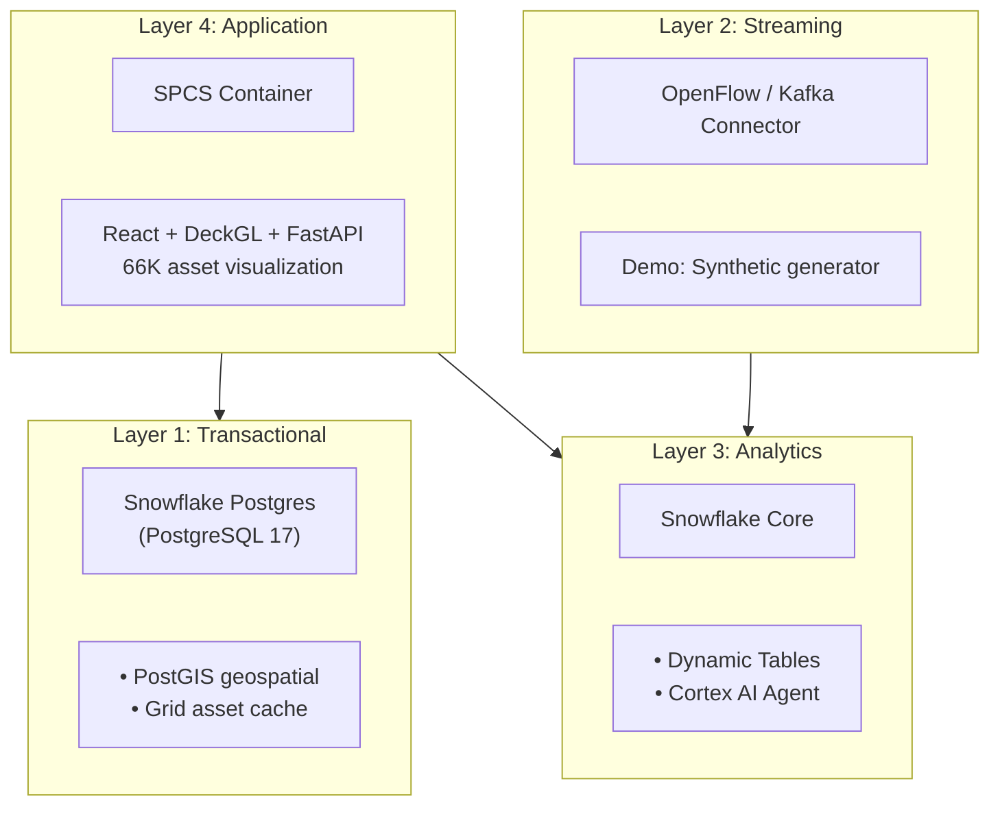

# Flux Operations Center

[](https://www.snowflake.com)
[](LICENSE)

A utility grid operations demo platform built on Snowflake.

## Flux Utility Platform

Flux Operations Center is part of the **Flux Utility Platform** - a suite of Snowflake solutions for utility industry demos:

| Repository | Purpose | Start Here If... |
|------------|---------|------------------|
| [Flux Utility Solutions](https://github.com/sfc-gh-abannerjee/flux-utility-solutions) | Core platform with Cortex AI, semantic models, 5 deployment paths | You're building a complete utility demo |
| [Flux Data Forge](https://github.com/sfc-gh-abannerjee/flux-data-forge) | Synthetic AMI data generation with streaming | You need realistic test data at scale |
| **Flux Ops Center** (this repo) | Real-time grid visualization, GNN risk prediction | You need interactive grid maps |

**Recommended flow**: Deploy Flux Utility Solutions first for core data model, use Data Forge to populate with AMI data, then add Ops Center for visualization.

---

<p align="center">
  
  
</p>

## Overview

Flux Operations Center is a grid operations demo that combines:
- **Interactive visualization** of 66K+ grid assets (substations, transformers, feeders)
- **Cascade failure analysis** with Graph ML predictions
- **AI-powered insights** via Snowflake Cortex Agents
- **Dual-backend architecture** for fast transactional queries and analytics

---

## Documentation

| Document | Description |
|----------|-------------|
| **[docs/LOCAL_DEVELOPMENT_GUIDE.md](./docs/LOCAL_DEVELOPMENT_GUIDE.md)** | Complete local dev setup, authentication, troubleshooting |
| **[docs/DATA_LOADING_GUIDE.md](./docs/DATA_LOADING_GUIDE.md)** | Data loading instructions |
| **[docs/API_REFERENCE.md](./docs/API_REFERENCE.md)** | REST API overview (62 endpoints) |
| [docs/INDEX.md](./docs/INDEX.md) | Documentation index |
| [docs/POSTGRES_SYNC_RELIABILITY.md](./docs/POSTGRES_SYNC_RELIABILITY.md) | Snowflake Postgres sync architecture |
| [docs/CASCADE_ANALYSIS.md](./docs/CASCADE_ANALYSIS.md) | Cascade analysis technical details |

---

## Deployment Options

Flux Operations Center supports multiple deployment paths to match your workflow:

| Path | Best For | Getting Started |
|------|----------|-----------------|
| **CLI Quickstart** | Interactive guided deployment | `./scripts/quickstart.sh` |
| **Terraform** | Infrastructure-as-Code, CI/CD | `cd terraform && terraform apply` |
| **SQL Scripts** | Manual step-by-step deployment | Run `git_deploy/deploy_from_git.sql` |
| **Git Integration** | Deploy from Snowflake UI | See `git_deploy/README.md` |

### Recommended: CLI Quickstart

```bash
# Interactive deployment with prompts for all configuration
./scripts/quickstart.sh
```

This script will:
1. Validate your environment (Docker, credentials)
2. Build the Docker image
3. Push to Snowflake registry
4. Generate deployment SQL

### Alternative: Terraform

```bash
cd terraform
cp terraform.tfvars.example terraform.tfvars
# Edit terraform.tfvars with your values
terraform init
terraform apply
```

See [terraform/README.md](terraform/README.md) for full documentation.

---

## Quick Start (Local Development)

### Prerequisites

- Python 3.11+
- Node.js 18+
- Snowflake CLI with a configured connection
- Snowflake account with appropriate permissions

### Setup

```bash
# Clone the repository
git clone <repository-url>
cd flux_ops_center_spcs

# Copy environment template and configure
cp .env.template .env
# Edit .env with your Snowflake credentials

# Install dependencies
pip install -r backend/requirements.txt
npm install
```

### Running Locally

```bash
# Terminal 1 - Backend (FastAPI)
SNOWFLAKE_CONNECTION_NAME=<your_connection> uvicorn backend.server_fastapi:app --host 0.0.0.0 --port 3001 --reload

# Terminal 2 - Frontend (Vite)
npm run dev
```

| Service | URL |
|---------|-----|
| Frontend | http://localhost:5173 |
| Backend API | http://localhost:3001 |
| Swagger Docs | http://localhost:3001/docs |

See [docs/LOCAL_DEVELOPMENT_GUIDE.md](./docs/LOCAL_DEVELOPMENT_GUIDE.md) for full setup instructions.

---

## Architecture



---

## Tech Stack

| Layer | Technology |
|-------|------------|
| Frontend | React 18, TypeScript, DeckGL 9.2, MapLibre GL, Material-UI 5 |
| Backend | FastAPI, Uvicorn (4 workers), nginx reverse proxy |
| Transactional DB | [Snowflake Postgres](https://docs.snowflake.com/en/user-guide/postgres/overview) (PostGIS) |
| Analytics DB | Snowflake Warehouse |
| ML/AI | PyTorch Geometric (GNN), Snowflake Cortex |
| Deployment | Snowpark Container Services (SPCS) |

> **Note**: Snowflake Postgres is in public preview (as of January 2025). Features and best practices may evolve.

---

## Configuration

### Environment Variables

Copy `.env.template` to `.env` and configure:

| Variable | Description |
|----------|-------------|
| `SNOWFLAKE_CONNECTION_NAME` | Your Snowflake CLI connection name |
| `VITE_SNOWFLAKE_ACCOUNT_URL` | Your Snowflake account URL |
| `VITE_POSTGRES_HOST` | Snowflake Postgres hostname |
| `VITE_POSTGRES_USER` | Postgres username |
| `VITE_POSTGRES_PASSWORD` | Postgres password |

**Security Note:** Never commit credentials to git. The `.env` file is in `.gitignore`.

---

## Features

### Cascade Failure Analysis
- Cascade simulation from any "patient zero" node
- Graph ML-based risk prediction using centrality metrics
- Wave-by-wave failure propagation visualization

### Grid Intelligence Assistant
- Natural language queries powered by Snowflake Cortex
- Context-aware responses about grid health and operations
- Integrated with live grid data

### Interactive Map Visualization
- 66K+ grid assets rendered with DeckGL
- Asset status visualization
- Geospatial layers (vegetation risk, flood zones, etc.)

---

## Project Structure

```
flux_ops_center_spcs/
├── README.md                    # This file
├── SECURITY.md                  # Security model and RBAC documentation
├── backend/
│   ├── server_fastapi.py        # FastAPI server (port 3001)
│   ├── requirements.txt         # Python dependencies
│   ├── gnn_training/            # GPU-based GNN model training (SPCS)
│   │   ├── Dockerfile.gpu       # GPU container for training
│   │   ├── run_training.py      # Training runner with status API
│   │   ├── train_gnn_model.py   # GNN model definition
│   │   └── service_spec.yaml    # SPCS GPU service spec
│   ├── ml/                      # ML model deployment
│   │   ├── deploy_inference_service.py
│   │   └── 01_ml_demo_setup.sql
│   └── scripts/                 # Utility scripts
│       ├── cascade_simulator.py
│       ├── compute_graph_centrality.py
│       └── sync_snowflake_to_postgres.py
├── src/                         # React frontend (TypeScript)
│   ├── App.tsx                  # Main application (~11K lines)
│   ├── ChatDrawer.tsx           # Cortex Agent chat interface
│   ├── components/              # React components
│   ├── hooks/                   # Custom React hooks
│   └── types/                   # TypeScript type definitions
├── docs/                        # Documentation
│   ├── INDEX.md                 # Documentation index
│   ├── LOCAL_DEVELOPMENT_GUIDE.md
│   ├── DATA_LOADING_GUIDE.md
│   ├── CASCADE_ANALYSIS.md
│   ├── POSTGRES_SYNC_RELIABILITY.md
│   └── VEGETATION_RISK_ARCHITECTURE.md
├── Dockerfile.spcs              # SPCS production container
├── service_spec_prod.yaml       # SPCS service specification (template)
└── .env.template                # Environment variables template
```

---

## Troubleshooting

| Issue | Fix |
|-------|-----|
| Port 3001 in use | `lsof -ti:3001 \| xargs kill -9` |
| boto3 SSO error | Already handled in server_fastapi.py |
| Snowflake connection fails | Verify `SNOWFLAKE_CONNECTION_NAME` is set correctly |
| Cortex Agent 401/403 | Verify `SNOWFLAKE_PAT` is set |

See [docs/LOCAL_DEVELOPMENT_GUIDE.md](./docs/LOCAL_DEVELOPMENT_GUIDE.md) for detailed troubleshooting.

---

## Contributing

See [CONTRIBUTING.md](CONTRIBUTING.md) for development setup and contribution guidelines.

1. Fork the repository
2. Create a feature branch (`git checkout -b feature/amazing-feature`)
3. Commit your changes (`git commit -m 'Add amazing feature'`)
4. Push to the branch (`git push origin feature/amazing-feature`)
5. Open a Pull Request

---

## License

This project is provided as a reference implementation. See [LICENSE](./LICENSE) for details.

---

## Acknowledgments

Built with [Snowflake](https://www.snowflake.com/) technologies:
- Snowpark Container Services (SPCS)
- Snowflake Postgres
- Snowflake Cortex AI
- Dynamic Tables
