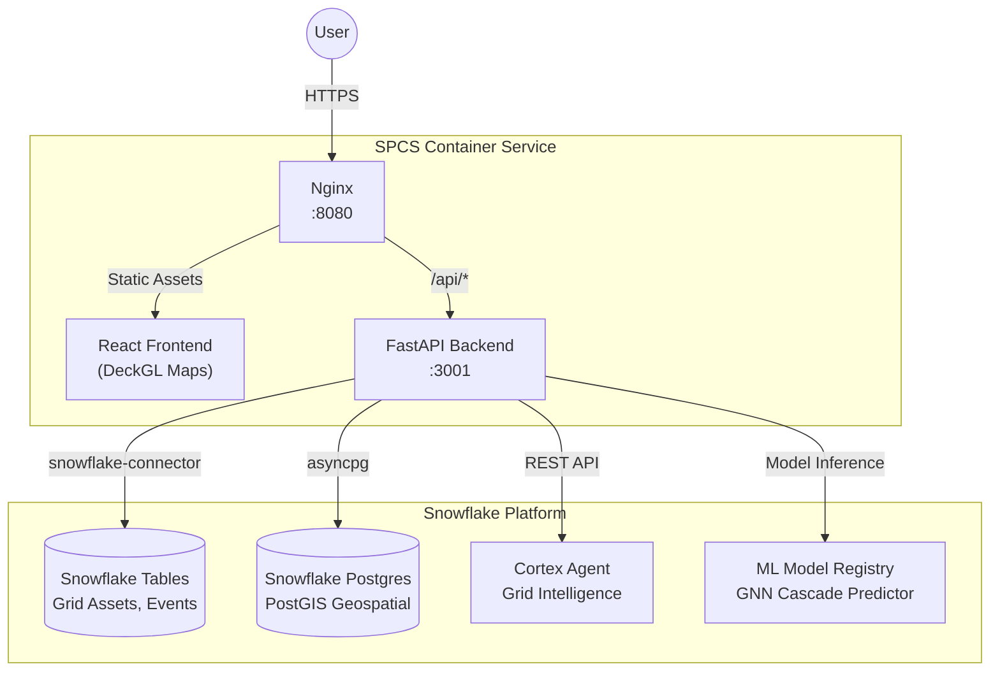

# Flux Operations Center

[](https://www.snowflake.com)
[](LICENSE)
[](https://github.com/sfc-gh-abannerjee/flux-ops-center-spcs/pkgs/container/flux-ops-center-spcs)

**See your grid. Predict cascade failures before they happen.** Real-time visualization of 66K+ grid assets with GNN-based risk prediction — giving operations teams the situational awareness to prevent outages, not just respond to them.

> *"Whether it's keeping the grid secure, protecting critical assets, or balancing supply and demand in volatile markets, energy companies need a trusted data foundation that can activate AI everywhere."* — Fred Cohagan, Global Head of Energy, Snowflake
>
> Built to demonstrate the grid resilience and asset health monitoring capabilities at the heart of [Snowflake Energy Solutions](https://www.snowflake.com/en/solutions/industries/energy/).

<p align="center">
  
  
</p>

---

## Why Flux Ops Center?

Utilities today manage aging infrastructure across thousands of miles of transmission and distribution lines — but most lack real-time visibility into how failures propagate. A single transformer outage can cascade through interconnected feeders, affecting thousands of customers. NERC TPL-001 reliability standards require utilities to model these scenarios, yet many still rely on static spreadsheets and post-event analysis.

This repository delivers **real-time grid situational awareness and AI-powered failure prediction** on Snowflake:

| What You Get | Why It Matters |
|--------------|----------------|
| **Interactive grid maps** | 66K+ assets visualized with DeckGL and PostGIS — real-time situational awareness for control rooms and field teams |
| **Cascade failure simulation** | GNN-based risk prediction showing how failures propagate — identify vulnerable assets before outages happen |
| **Grid Intelligence Agent** | Natural language queries about grid status — operations staff and field engineers get answers without writing SQL |
| **Multi-arch Docker images** | Pre-built images for both local development (ARM64) and SPCS deployment (AMD64) — deploy in minutes |

---

## Quick Start

```bash
git clone https://github.com/sfc-gh-abannerjee/flux-ops-center-spcs.git
cd flux-ops-center-spcs

# 1. Create database, schemas, and sample data
snow sql -c your_connection -f scripts/sql/00_standalone_quickstart.sql

# 2. Deploy everything (interactive — builds, deploys, sets up Postgres + Cortex)
./scripts/quickstart.sh

# 3. Load PostGIS map data (~390MB from GitHub Releases)
python backend/scripts/load_postgis_data.py --service your_pg_service
```

The quickstart script handles all 13 steps: Docker image build/push, compute pool, SPCS service, Snowflake Postgres with PostGIS, External Access Integrations, and Grid Intelligence Agent setup.

> **Map Layers**: Buildings are visible by default. Power lines and vegetation risk layers are **off by default** — toggle them on in the Layers panel (top-right of map).

**[Full Quick Start Guide →](docs/deployment/QUICKSTART.md)**

---

## Snowflake Features

| Category | Features |
|----------|----------|
| **Cortex AI** | [Agents](https://docs.snowflake.com/en/user-guide/snowflake-cortex/cortex-agents), [LLM Functions](https://docs.snowflake.com/en/user-guide/snowflake-cortex/llm-functions) |
| **Machine Learning** | [Snowpark ML](https://docs.snowflake.com/en/developer-guide/snowflake-ml/overview), [Model Registry](https://docs.snowflake.com/en/developer-guide/snowflake-ml/model-registry/overview) |
| **Applications** | [SPCS](https://docs.snowflake.com/en/developer-guide/snowpark-container-services/overview), [Snowflake Postgres](https://docs.snowflake.com/en/user-guide/snowflake-postgres/about) |
| **Data** | [Dynamic Tables](https://docs.snowflake.com/en/user-guide/dynamic-tables-about), [Stages](https://docs.snowflake.com/en/user-guide/data-load-overview) |

---

## Documentation

| Guide | Description |
|-------|-------------|
| **[Deployment Options](docs/deployment/)** | Choose your deployment method |
| **[Docker Images](docs/DOCKER_IMAGES.md)** | Pre-built images, multi-arch support |
| **[Local Development](docs/LOCAL_DEVELOPMENT_GUIDE.md)** | Development setup |
| **[API Reference](docs/API_REFERENCE.md)** | REST API documentation |
| **[Cascade Analysis](docs/CASCADE_ANALYSIS.md)** | GNN risk prediction |

---

## Features

Each feature addresses a core grid operations challenge — from real-time monitoring to predictive risk management and natural language access for non-technical staff.

### Interactive Map
- 66K+ grid assets with DeckGL — real-time situational awareness
- Live status visualization across substations, transformers, and feeders
- Geospatial layers (vegetation risk, flood zones) for proactive risk assessment

### Cascade Failure Analysis
- Simulate failures from any node — model how outages propagate before they happen
- GNN-based risk prediction aligned with NERC TPL-001 reliability planning
- Wave-by-wave propagation visualization for engineering and planning teams

### Grid Intelligence Agent
- Ask grid questions in plain English — no SQL required for operations staff and field engineers
- 5-tool AI agent: text-to-SQL analytics, customer search, meter lookup, technical docs, and NERC compliance docs
- RAG-powered search across 20K technical manual chunks and regulatory standards
- Set up automatically by `quickstart.sh` Step 12

**[Agent Setup Details →](docs/deployment/QUICKSTART.md#grid-intelligence-agent)**

---

## Architecture


```mermaid
flowchart TB
    subgraph SPCS["SPCS Container Service"]
        direction LR
        NGINX["Nginx<br/>:8080"]
        REACT["React Frontend<br/>(DeckGL Maps)"]
        FASTAPI["FastAPI Backend<br/>:3001"]
        
        NGINX -->|"Static Assets"| REACT
        NGINX -->|"/api/*"| FASTAPI
    end
    
    subgraph SNOWFLAKE["Snowflake Platform"]
        direction TB
        TABLES[("Snowflake Tables<br/>Grid Assets, Events")]
        POSTGRES[("Snowflake Postgres<br/>PostGIS Geospatial")]
        CORTEX["Cortex Agent<br/>Grid Intelligence"]
        GNN["ML Model Registry<br/>GNN Cascade Predictor"]
    end
    
    FASTAPI -->|"snowflake-connector"| TABLES
    FASTAPI -->|"asyncpg"| POSTGRES
    FASTAPI -->|"REST API"| CORTEX
    FASTAPI -->|"Model Inference"| GNN
    
    USER((User)) -->|"HTTPS"| NGINX
```

---

## Flux Platform Ecosystem

Part of a complete grid intelligence stack built on Snowflake — from data foundation through real-time operations:

| Repository | Purpose |
|------------|---------|
| [**flux-utility-solutions**](https://github.com/sfc-gh-abannerjee/flux-utility-solutions) | Core data foundation — unified grid data model, Cortex AI agent, semantic views |
| [flux-data-forge](https://github.com/sfc-gh-abannerjee/flux-data-forge) | Synthetic AMI data generation — simulate millions of meter readings |
| **flux-ops-center** (this repo) | Real-time grid visualization and cascade failure prediction — operational situational awareness |

**Standalone deployment** creates everything locally. **Integrated deployment** shares data across all apps.

---

## Deployment Options

| Method | Best For | Guide |
|--------|----------|-------|
| **Quick Start** | Demos, first-time users | [docs/deployment/QUICKSTART.md](docs/deployment/QUICKSTART.md) |
| **CLI Scripts** | Step-by-step control | [docs/deployment/CLI_SCRIPTS.md](docs/deployment/CLI_SCRIPTS.md) |
| **Terraform** | Enterprise IaC | [docs/deployment/TERRAFORM.md](docs/deployment/TERRAFORM.md) |
| **Notebooks** | Workshops, data science | [docs/deployment/NOTEBOOKS.md](docs/deployment/NOTEBOOKS.md) |
| **Git Integration** | CI/CD pipelines | [docs/deployment/GIT_INTEGRATION.md](docs/deployment/GIT_INTEGRATION.md) |

---

## Docker Images

Pre-built multi-architecture images available on GitHub Container Registry:

```bash
# Auto-selects your architecture (amd64 or arm64)
docker pull ghcr.io/sfc-gh-abannerjee/flux-ops-center-spcs:main

# For Snowflake SPCS (requires amd64)
docker pull --platform linux/amd64 ghcr.io/sfc-gh-abannerjee/flux-ops-center-spcs:main
```

| Architecture | Use Case |
|--------------|----------|
| `linux/amd64` | Snowflake SPCS, Intel/AMD servers |
| `linux/arm64` | Apple Silicon (M1/M2/M3/M4), AWS Graviton |

**[Full Docker Guide →](docs/DOCKER_IMAGES.md)**

---

## Prerequisites

- Snowflake account with ACCOUNTADMIN role
- [Snowflake CLI](https://docs.snowflake.com/en/developer-guide/snowflake-cli/installation/installation)
- [Docker Desktop](https://www.docker.com/products/docker-desktop/) (or use pre-built images)

---

## Project Structure

```
flux-ops-center-spcs/
├── docs/                    # Documentation
│   ├── deployment/          # Deployment guides (QUICKSTART, CLI_SCRIPTS, etc.)
│   ├── DOCKER_IMAGES.md     # Container image guide
│   └── ...
├── scripts/
│   ├── sql/                 # SQL deployment scripts (00-09)
│   └── quickstart.sh        # Interactive 13-step deployment
├── data/
│   ├── cortex_search_data/  # Sample data for Grid Intelligence Agent
│   └── postgis_exports/     # PostGIS data loading scripts
├── backend/                 # FastAPI server (Python)
│   └── scripts/             # Data loading scripts (load_postgis_data.py)
├── src/                     # React frontend (TypeScript)
├── terraform/               # IaC configuration
├── notebooks/               # Snowflake notebooks
└── git_deploy/              # GitOps deployment
```

---

## Contributing

See [CONTRIBUTING.md](CONTRIBUTING.md) for guidelines.

## License

Apache 2.0 - see [LICENSE](LICENSE)

---

<p align="center">
  <strong>Built on Snowflake AI Data Cloud</strong><br/>
  <em>Part of the <a href="https://www.snowflake.com/en/solutions/industries/energy/">Snowflake Energy Solutions</a> ecosystem</em>
</p>
