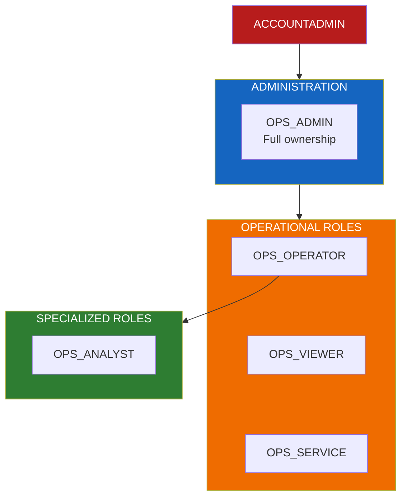
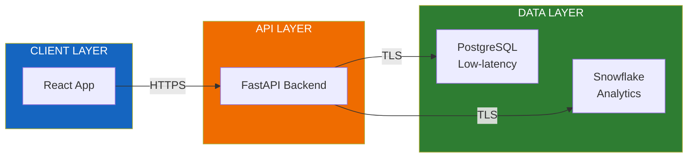

# Security Model

Role-based access control (RBAC) and security configuration for Flux Operations Center.

---

## Role Hierarchy



---

## Role Definitions

| Role | Purpose | Typical Users |
|------|---------|---------------|
| **OPS_ADMIN** | Full ownership of all objects | Platform administrators |
| **OPS_OPERATOR** | Grid operations and monitoring | Control room operators |
| **OPS_VIEWER** | Read-only dashboard access | Managers, stakeholders |
| **OPS_SERVICE** | Backend API and SPCS services | Applications, automated processes |
| **OPS_ANALYST** | Cortex Agent and ML access | Data scientists, analysts |

---

## Permission Matrix

| Role | Database | Warehouse | Cortex Agent | ML Models | PostgreSQL |
|------|----------|-----------|--------------|-----------|------------|
| **Admin** | OWNERSHIP | OPERATE | ALL | ALL | ALL |
| **Operator** | USAGE | USAGE | USAGE | USAGE | READ/WRITE |
| **Viewer** | USAGE | USAGE | - | - | READ |
| **Service** | USAGE | USAGE | USAGE | USAGE | READ/WRITE |
| **Analyst** | USAGE | USAGE | USAGE | ALL | READ |

---

## Architecture Security



---

## Credential Management

### Environment Variables

All credentials are managed via environment variables. **Never commit credentials to version control.**

| Variable | Purpose | Required |
|----------|---------|----------|
| `SNOWFLAKE_CONNECTION_NAME` | Snowflake CLI connection | Yes |
| `VITE_POSTGRES_HOST` | PostgreSQL hostname | Yes |
| `VITE_POSTGRES_USER` | PostgreSQL username | Yes |
| `VITE_POSTGRES_PASSWORD` | PostgreSQL password | Yes |

### Local Development

```bash
# Copy template and configure
cp .env.template .env

# Edit with your credentials (never commit .env)
# .env is listed in .gitignore
```

### Production (SPCS)

```yaml
# Secrets are injected via Snowflake Secrets
secrets:
  - snowflakeSecret: DATABASE.SCHEMA.POSTGRES_CREDENTIALS
    secretKeyRef: password
    envVarName: VITE_POSTGRES_PASSWORD
```

---

## Schema-Level Permissions

| Schema | Admin | Operator | Viewer | Service | Analyst |
|--------|-------|----------|--------|---------|---------|
| **PRODUCTION** | OWNERSHIP | SELECT | SELECT | SELECT | SELECT |
| **APPLICATIONS** | OWNERSHIP | USAGE | USAGE | USAGE | USAGE |
| **ML_MODELS** | OWNERSHIP | - | - | SELECT | USAGE |

---

## Role Creation Scripts

### Admin Role

```sql
CREATE ROLE IF NOT EXISTS OPS_ADMIN;
GRANT OWNERSHIP ON DATABASE FLUX_OPS TO ROLE OPS_ADMIN;
GRANT OPERATE ON WAREHOUSE FLUX_WH TO ROLE OPS_ADMIN;
```

### Operator Role

```sql
CREATE ROLE IF NOT EXISTS OPS_OPERATOR;
GRANT USAGE ON DATABASE FLUX_OPS TO ROLE OPS_OPERATOR;
GRANT USAGE ON WAREHOUSE FLUX_WH TO ROLE OPS_OPERATOR;
GRANT SELECT ON ALL TABLES IN SCHEMA PRODUCTION TO ROLE OPS_OPERATOR;
GRANT SELECT ON ALL TABLES IN SCHEMA APPLICATIONS TO ROLE OPS_OPERATOR;
```

### Viewer Role

```sql
CREATE ROLE IF NOT EXISTS OPS_VIEWER;
GRANT USAGE ON DATABASE FLUX_OPS TO ROLE OPS_VIEWER;
GRANT USAGE ON WAREHOUSE FLUX_WH TO ROLE OPS_VIEWER;
GRANT SELECT ON ALL VIEWS IN SCHEMA APPLICATIONS TO ROLE OPS_VIEWER;
```

### Service Role

```sql
CREATE ROLE IF NOT EXISTS OPS_SERVICE;
GRANT USAGE ON DATABASE FLUX_OPS TO ROLE OPS_SERVICE;
GRANT USAGE ON WAREHOUSE FLUX_WH TO ROLE OPS_SERVICE;
GRANT USAGE ON COMPUTE POOL ops_compute_pool TO ROLE OPS_SERVICE;
GRANT SELECT ON SECRET POSTGRES_CREDENTIALS TO ROLE OPS_SERVICE;
```

### Analyst Role

```sql
CREATE ROLE IF NOT EXISTS OPS_ANALYST;
GRANT ROLE OPS_VIEWER TO ROLE OPS_ANALYST;
GRANT USAGE ON CORTEX AGENT grid_intelligence_agent TO ROLE OPS_ANALYST;
GRANT USAGE ON MODEL cascade_risk_model TO ROLE OPS_ANALYST;
```

---

## PostgreSQL Security

### Connection Security

- TLS encryption required for all connections
- Managed PostgreSQL instance (Snowflake-hosted)
- No public internet exposure

### User Permissions

```sql
-- Application user (read/write for caching)
CREATE USER application WITH PASSWORD '***';
GRANT SELECT, INSERT, UPDATE, DELETE ON ALL TABLES IN SCHEMA public TO application;

-- Read-only user (for dashboards)
CREATE USER readonly WITH PASSWORD '***';
GRANT SELECT ON ALL TABLES IN SCHEMA public TO readonly;
```

---

## Best Practices

### Principle of Least Privilege

- Grant minimum permissions needed for each role
- Use role hierarchy to inherit common permissions
- Review and audit permissions regularly

### Secrets Management

- Store credentials in Snowflake Secrets
- Use environment variables for local development
- Rotate credentials periodically
- Never commit `.env` files

### Audit Logging

```sql
-- Query access history for Flux Operations Center
SELECT *
FROM SNOWFLAKE.ACCOUNT_USAGE.ACCESS_HISTORY
WHERE query_start_time > DATEADD(day, -7, CURRENT_TIMESTAMP())
  AND direct_objects_accessed LIKE '%FLUX%'
  OR direct_objects_accessed LIKE '%OPS%';
```

---

## Reporting Security Issues

If you discover a security vulnerability, please report it responsibly:

1. **Do not** create a public GitHub issue
2. Email: security@snowflake.com
3. Include steps to reproduce the issue

See [docs/LOCAL_DEVELOPMENT_GUIDE.md](./docs/LOCAL_DEVELOPMENT_GUIDE.md) for development setup instructions.
