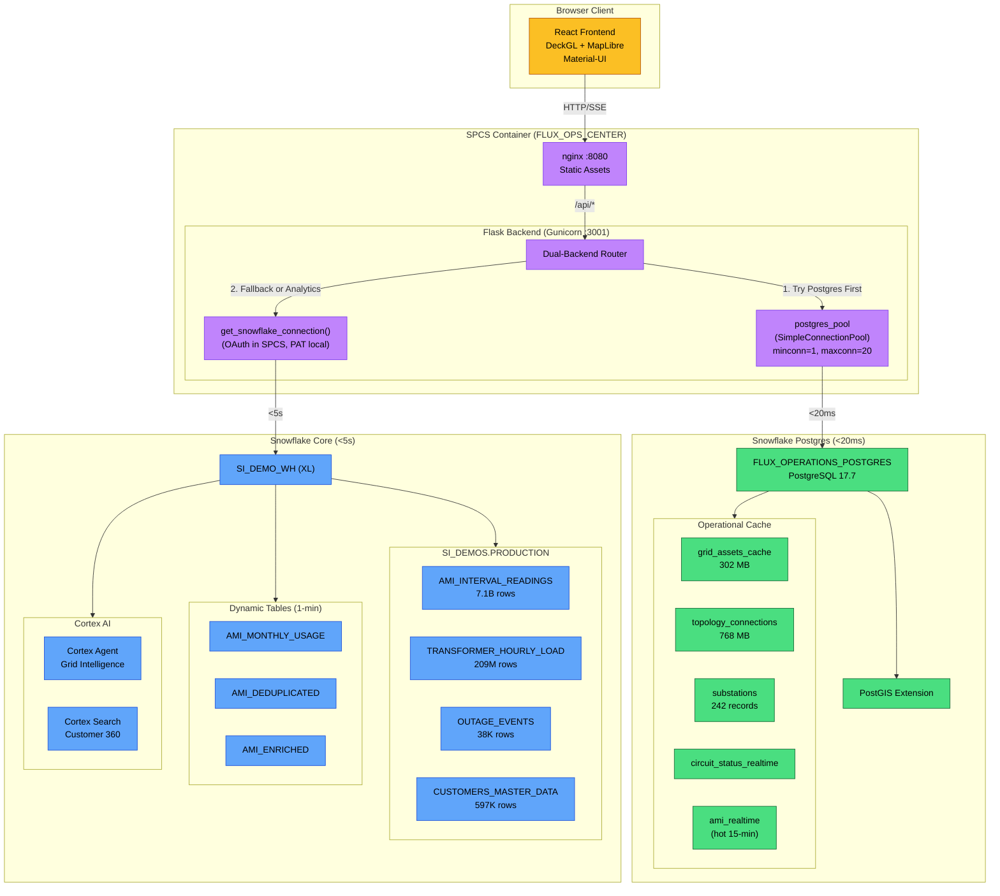
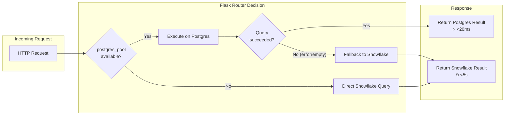
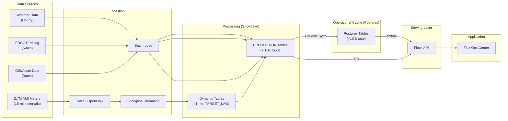
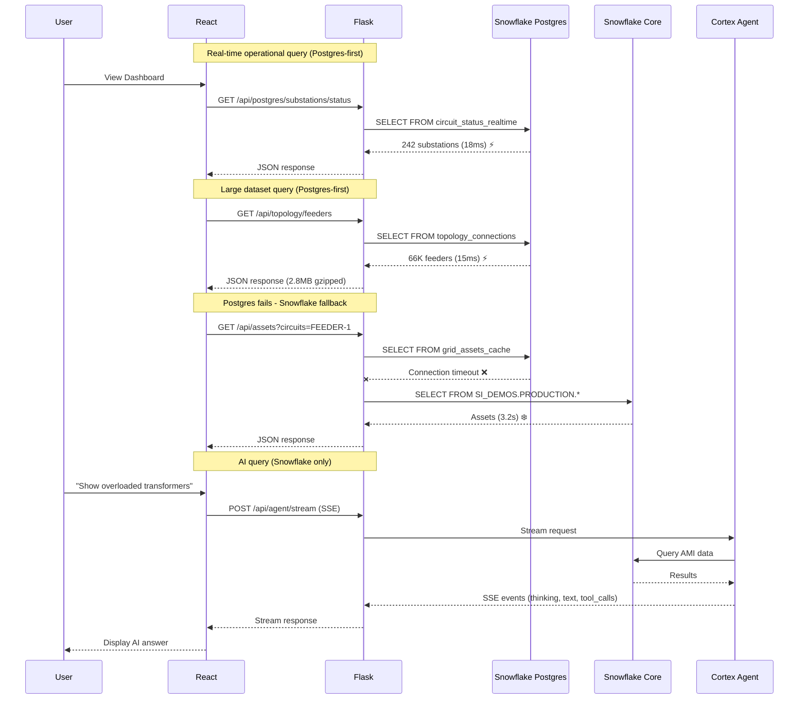
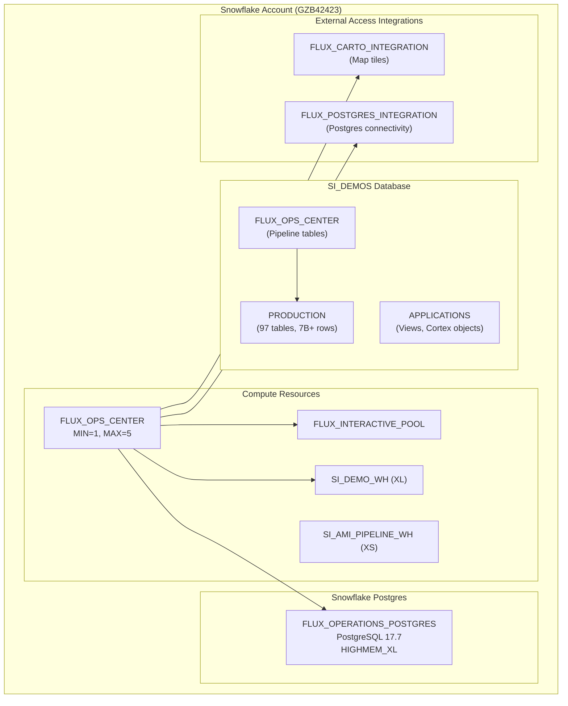

# Flux Operations Center - Architecture Diagram

**Version:** 2.2  
**Date:** January 12, 2026  
**Status:** Production (SPCS RUNNING)

> **⚠️ NOTE:** The authoritative architecture documentation is now consolidated in `/Users/abannerjee/Documents/cpe_poc/PROJECT_STATUS.md` under the section "🗺️ Flux Operations Center - Comprehensive Architecture". This file is retained for diagram reference but may contain outdated details.

---

## Dual-Backend Architecture Overview

The Flux Operations Center uses a **dual-backend architecture** where the Flask API intelligently routes requests to either Snowflake Postgres (for real-time <20ms queries) or Snowflake Core (for analytics <5s queries), with automatic fallback.

```
┌─────────────────────────────────────────────────────────────────────────────────────────────────┐
│                           FLUX OPERATIONS CENTER - DUAL BACKEND ARCHITECTURE                     │
│                              (Grid Operations Grid Operations Platform)                        │
├─────────────────────────────────────────────────────────────────────────────────────────────────┤
│                                                                                                   │
│   ┌───────────────────────────────────────────────────────────────────────────────────────────┐  │
│   │                              SPCS APPLICATION LAYER                                        │  │
│   │                              ══════════════════════                                        │  │
│   │                                                                                            │  │
│   │   ┌────────────────────────────────────────────────────────────────────────────────────┐  │  │
│   │   │                    FLUX_OPS_CENTER SERVICE (SPCS Container)                        │  │  │
│   │   │                    Compute Pool: FLUX_INTERACTIVE_POOL                              │  │  │
│   │   │                    MIN_INSTANCES=1, MAX_INSTANCES=5                                  │  │  │
│   │   │                                                                                      │  │  │
│   │   │    ┌─────────────────────────┐         ┌─────────────────────────────────────────┐  │  │  │
│   │   │    │    NGINX (:8080)        │         │         FLASK BACKEND                   │  │  │  │
│   │   │    │    ─────────────        │         │         (Gunicorn :3001, 4 workers)     │  │  │  │
│   │   │    │                         │         │         ─────────────────────────       │  │  │  │
│   │   │    │    React 18 + Vite      │  /api/* │                                         │  │  │  │
│   │   │    │    DeckGL 8.9           │ ──────▶ │    ┌─────────────────────────────────┐  │  │  │  │
│   │   │    │    MapLibre GL          │         │    │      DUAL-BACKEND ROUTER        │  │  │  │  │
│   │   │    │    Material-UI 5        │         │    │                                 │  │  │  │  │
│   │   │    │                         │         │    │  postgres_pool ─┐               │  │  │  │  │
│   │   │    │    66K Feeder Lines     │         │    │  (SimpleConnectionPool)         │  │  │  │  │
│   │   │    │    242 Substations      │         │    │  minconn=1, maxconn=20          │  │  │  │  │
│   │   │    │    Real-time KPIs       │         │    │               │                 │  │  │  │  │
│   │   │    │                         │         │    │               ▼                 │  │  │  │  │
│   │   │    │                         │         │    │  ┌─────────────────────────┐    │  │  │  │  │
│   │   │    │                         │         │    │  │ TRY POSTGRES FIRST     │    │  │  │  │  │
│   │   │    │                         │         │    │  │ (<20ms target)         │    │  │  │  │  │
│   │   │    │                         │         │    │  └───────────┬─────────────┘    │  │  │  │  │
│   │   │    │                         │         │    │              │                  │  │  │  │  │
│   │   │    │                         │         │    │         SUCCESS?               │  │  │  │  │
│   │   │    │                         │         │    │        /        \              │  │  │  │  │
│   │   │    │                         │         │    │      YES         NO            │  │  │  │  │
│   │   │    │                         │         │    │       │           │            │  │  │  │  │
│   │   │    │                         │         │    │       ▼           ▼            │  │  │  │  │
│   │   │    │                         │         │    │   [RETURN]   [SNOWFLAKE        │  │  │  │  │
│   │   │    │                         │         │    │              FALLBACK]         │  │  │  │  │
│   │   │    │                         │         │    │              (<5s target)      │  │  │  │  │
│   │   │    │                         │         │    └─────────────────────────────┘    │  │  │  │
│   │   │    └─────────────────────────┘         └─────────────────────────────────────────┘  │  │  │
│   │   │                                                                                      │  │  │
│   │   └──────────────────────────────────────────────────────────────────────────────────────┘  │  │
│   │                                                                                            │  │
│   └────────────────────────────────────────────────────────────────────────────────────────────┘  │
│                                                    │                                              │
│                           ┌────────────────────────┴────────────────────────┐                    │
│                           │                                                 │                    │
│                           ▼                                                 ▼                    │
│   ┌────────────────────────────────────────┐    ┌────────────────────────────────────────────┐  │
│   │      SNOWFLAKE POSTGRES                │    │           SNOWFLAKE CORE                   │  │
│   │      (Real-Time Backend)               │    │           (Analytics Backend)              │  │
│   │      ════════════════════              │    │           ════════════════════             │  │
│   │                                        │    │                                            │  │
│   │   Instance: FLUX_OPERATIONS_POSTGRES   │    │   Database: SI_DEMOS                       │  │
│   │   PostgreSQL 17.7 | HIGHMEM_XL         │    │   Warehouse: SI_DEMO_WH (XL)               │  │
│   │   Latency: <20ms                       │    │   Latency: <5s                             │  │
│   │                                        │    │                                            │  │
│   │   ┌──────────────────────────────────┐ │    │   ┌──────────────────────────────────────┐ │  │
│   │   │ OPERATIONAL CACHE TABLES         │ │    │   │ ANALYTICAL TABLES                    │ │  │
│   │   │                                  │ │    │   │                                      │ │  │
│   │   │ • grid_assets_cache (302 MB)     │ │    │   │ • AMI_INTERVAL_READINGS (7.1B rows)  │ │  │
│   │   │ • topology_connections (768 MB)  │ │    │   │ • TRANSFORMER_HOURLY_LOAD (209M)     │ │  │
│   │   │ • substations (242 records)      │ │    │   │ • OUTAGE_EVENTS (38K rows)           │ │  │
│   │   │ • circuit_status_realtime        │ │    │   │ • CUSTOMERS_MASTER_DATA (597K)       │ │  │
│   │   │ • ami_realtime (hot 15-min)      │ │    │   │ • HOUSTON_WEATHER_HOURLY (4.4K)      │ │  │
│   │   │                                  │ │    │   │ • WEATHER_EVENTS (31 rows)           │ │  │
│   │   │ Extensions:                      │ │    │   │                                      │ │  │
│   │   │ • PostGIS (geospatial)           │ │    │   │ Dynamic Tables (1-min refresh):      │ │  │
│   │   │ • pg_lake (Iceberg sync)         │ │    │   │ • AMI_MONTHLY_USAGE                  │ │  │
│   │   └──────────────────────────────────┘ │    │   │ • AMI_DEDUPLICATED                   │ │  │
│   │                                        │    │   │ • AMI_ENRICHED                       │ │  │
│   │   API Endpoints (Postgres-first):      │    │   └──────────────────────────────────────┘ │  │
│   │   • /api/postgres/substations/status   │    │                                            │  │
│   │   • /api/topology/feeders              │    │   ┌──────────────────────────────────────┐ │  │
│   │   • /api/substations                   │    │   │ CORTEX AI SERVICES                   │ │  │
│   │   • /api/assets                        │    │   │                                      │ │  │
│   │   • /api/circuits/metadata             │    │   │ • Cortex Agent (Grid Intelligence)   │ │  │
│   │   • /api/outages/active                │    │   │   - Semantic Model (NL→SQL)          │ │  │
│   │   • /api/work-orders/active            │    │   │   - Tool calling (search, analyst)   │ │  │
│   │   │                                    │    │   │   - SSE streaming responses          │ │  │
│   │   API Endpoints (Snowflake):           │    │   │                                      │ │  │
│   │   • /api/kpis (aggregations)           │    │   │ • Cortex Search Service              │ │  │
│   │   • /api/weather (historical)          │    │   │   - CUSTOMER_SEARCH_SERVICE          │ │  │
│   │   • /api/agent/stream (Cortex AI)      │    │   │   - 597K customers indexed           │ │  │
│   │                                        │    │   │   - snowflake-arctic-embed-l-v2.0    │ │  │
│   └────────────────────────────────────────┘    │   └──────────────────────────────────────┘ │  │
│                                                 │                                            │  │
│                                                 └────────────────────────────────────────────┘  │
│                                                                                                   │
│   ┌───────────────────────────────────────────────────────────────────────────────────────────┐  │
│   │                              STREAMING / INGESTION LAYER                                   │  │
│   │                              ═══════════════════════════                                   │  │
│   │                                                                                            │  │
│   │    ┌────────────────────┐    ┌────────────────────┐    ┌────────────────────────────────┐ │  │
│   │    │   DEMO MODE        │    │   PoC MODE         │    │   PRODUCTION MODE              │ │  │
│   │    │   (Current)        │    │   (Confluent)      │    │   (CNP Infrastructure)         │ │  │
│   │    │                    │    │                    │    │                                │ │  │
│   │    │   Synthetic Gen    │    │   Datagen          │    │   2.7M AMI Meters              │ │  │
│   │    │   (Streamlit/CLI)  │    │   Connector        │    │   (Itron/L+G Head-End)         │ │  │
│   │    │        │           │    │        │           │    │        │                       │ │  │
│   │    │        ▼           │    │        ▼           │    │        ▼                       │ │  │
│   │    │   Snowpipe         │    │   Confluent        │    │   CNP Kafka Cluster            │ │  │
│   │    │   Streaming SDK    │    │   Kafka            │    │        │                       │ │  │
│   │    │        │           │    │        │           │    │        ▼                       │ │  │
│   │    │        │           │    │        ▼           │    │   OpenFlow SPCS                │ │  │
│   │    │        │           │    │   Snowflake        │    │   (NiFi Visual Canvas)         │ │  │
│   │    │        │           │    │   Kafka Connector  │    │                                │ │  │
│   │    └────────┼───────────┘    └────────┼───────────┘    └────────────────┼───────────────┘ │  │
│   │             │                         │                                 │                 │  │
│   │             └─────────────────────────┴─────────────────────────────────┘                 │  │
│   │                                       │                                                   │  │
│   │                                       ▼                                                   │  │
│   │                    ┌──────────────────────────────────────────────┐                       │  │
│   │                    │       DYNAMIC TABLES PIPELINE                │                       │  │
│   │                    │       TARGET_LAG = '1 minute'                │                       │  │
│   │                    │                                              │                       │  │
│   │                    │   ┌──────────┐   ┌──────────┐   ┌──────────┐│                       │  │
│   │                    │   │  BRONZE  │   │  SILVER  │   │   GOLD   ││                       │  │
│   │                    │   │  (Raw)   │──▶│  (Dedup) │──▶│ (Enrich) ││                       │  │
│   │                    │   └──────────┘   └──────────┘   └──────────┘│                       │  │
│   │                    │                                              │                       │  │
│   │                    │   Dedup: QUALIFY ROW_NUMBER() OVER (...) = 1 │                       │  │
│   │                    │   Enrich: JOIN weather, ERCOT pricing        │                       │  │
│   │                    └──────────────────────────────────────────────┘                       │  │
│   │                                                                                            │  │
│   └────────────────────────────────────────────────────────────────────────────────────────────┘  │
│                                                                                                   │
└───────────────────────────────────────────────────────────────────────────────────────────────────┘

EXTERNAL ACCESS INTEGRATIONS:
• FLUX_CARTO_INTEGRATION - CartoDB Dark Matter basemap tiles
• FLUX_POSTGRES_INTEGRATION - Snowflake Postgres connectivity

ENDPOINT: https://bqbm57vg-sfsehol-si-ae-enablement-retail-hmjrfl.snowflakecomputing.app
```

---

## Mermaid Diagram - Dual Backend Architecture



---

## API Routing Logic



---

## API Endpoint Backend Mapping

| Endpoint | Primary Backend | Fallback | Latency Target | Data |
|----------|----------------|----------|----------------|------|
| `/api/postgres/substations/status` | Postgres | Snowflake | <20ms | 242 substations |
| `/api/topology/feeders` | Postgres | Snowflake | <20ms | 66K feeders (2.8MB) |
| `/api/substations` | Postgres | Snowflake | <10ms | 242 records |
| `/api/assets` | Postgres | Snowflake | <50ms | 502K assets cached |
| `/api/circuits/metadata` | Postgres | Snowflake | <20ms | Circuit status |
| `/api/outages/active` | Postgres | Snowflake | <20ms | Active outages |
| `/api/work-orders/active` | Postgres | Snowflake | <20ms | Work orders |
| `/api/kpis` | Snowflake | - | <5s | Aggregated KPIs |
| `/api/weather` | Snowflake | - | <5s | Weather analytics |
| `/api/agent/stream` | Snowflake (Cortex) | - | Streaming | AI responses |

---

## Data Flow Diagram



---

## Sequence Diagram - Dual Backend Request Flow



---

## Deployment Architecture



---

## Performance Summary

| Component | Target | Actual | Status |
|-----------|--------|--------|--------|
| **Postgres Queries** | <20ms | ~15ms | ✅ |
| **Snowflake Analytics** | <5s | ~3s | ✅ |
| **Dashboard Load** | <3s | ~3s | ✅ |
| **Cortex Agent** | Streaming | Streaming | ✅ |
| **Feeder Render** | <100ms | ~80ms | ✅ |
| **Cold Start** | N/A | 0s (MIN=1) | ✅ |

---

## Key Design Decisions

1. **Postgres-First Strategy**: All operational queries try Postgres first for <20ms latency
2. **Automatic Fallback**: If Postgres fails or returns empty, seamlessly fall back to Snowflake
3. **Connection Pooling**: `SimpleConnectionPool(minconn=1, maxconn=20)` prevents connection exhaustion
4. **Always-On**: `MIN_INSTANCES=1` eliminates cold starts for consistent UX
5. **Cortex AI Integration**: SSE streaming for real-time AI responses without timeout issues
6. **Dual Data Strategy**: 
   - Hot data in Postgres (~1GB) for real-time ops
   - Cold/historical data in Snowflake (7.1B rows) for analytics

---

**Live Endpoint:** https://f6bm57vg-sfsehol-si-ae-enablement-retail-hmjrfl.snowflakecomputing.app

---

## Document Superseded

> This document is superseded by PROJECT_STATUS.md "🗺️ Flux Operations Center - Comprehensive Architecture" section which contains validated, up-to-date information as of January 12, 2026.
