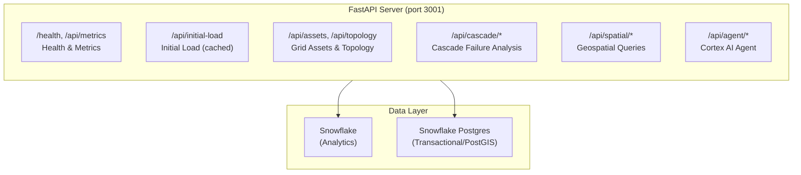

# API Reference

Flux Operations Center exposes a REST API for grid operations, cascade analysis, and AI-powered insights.

> **Live Documentation**: Run the server and visit [`/docs`](http://localhost:3001/docs) for interactive Swagger UI with full endpoint details, request/response schemas, and "Try it out" functionality.

---

## API Architecture



---

## Endpoint Categories

| Category | Endpoints | Description |
|----------|-----------|-------------|
| [Health & Metrics](#health--metrics) | 3 | Server health, performance metrics, cache management |
| [Initial Load](#initial-load) | 1 | Optimized bulk load for app startup |
| [Assets](#assets) | 1 | Grid asset queries with filtering |
| [Topology](#topology) | 5 | Network topology (substations, feeders, circuits) |
| [Operations](#operations) | 5 | KPIs, service areas, weather, substation status |
| [Outages & Work Orders](#outages--work-orders) | 2 | Active outages and work order tracking |
| [Cascade Analysis](#cascade-analysis) | 11 | Failure simulation, risk prediction, scenarios |
| [Cascade Analysis - Actionable](#cascade-analysis---actionable) | 5 | Economic impact, mitigation, restoration |
| [Cortex Agent](#cortex-agent) | 4 | AI chat with streaming responses |
| [Geospatial](#geospatial) | 12 | PostGIS spatial queries and analysis |
| [Geospatial Layers](#geospatial-layers) | 11 | Cached layer data for map rendering |
| [Snowflake ML](#snowflake-ml) | 1 | ML model predictions |
| [Vector Tiles](#vector-tiles) | 1 | MVT tiles for large datasets |

**Total: 62 endpoints**

---

## Health & Metrics

Server health and observability endpoints.

| Method | Endpoint | Description |
|--------|----------|-------------|
| `GET` | `/health` | Health check with optional detailed status |
| `GET` | `/api/metrics` | Request metrics (latency, error rates) |
| `DELETE` | `/api/cache` | Clear all caches |

### Example: Health Check

```bash
curl http://localhost:3001/health?detailed=true
```

```json
{
  "status": "healthy",
  "timestamp": "2024-01-15T10:30:00Z",
  "postgres": "connected",
  "snowflake": "connected",
  "cache_entries": 12
}
```

---

## Initial Load

Optimized endpoint for application startup - returns all data needed to render the initial map view in a single request.

| Method | Endpoint | Description |
|--------|----------|-------------|
| `GET` | `/api/initial-load` | Bulk load: assets, topology, KPIs, service areas |

### Example

```bash
curl http://localhost:3001/api/initial-load
```

Returns combined payload with metro topology, feeder topology, KPIs, and service areas (cached for performance).

---

## Assets

Query grid assets with filtering and pagination.

| Method | Endpoint | Description |
|--------|----------|-------------|
| `GET` | `/api/assets` | Query assets with filters |

### Parameters

| Parameter | Type | Description |
|-----------|------|-------------|
| `asset_type` | string | Filter by type (SUBSTATION, TRANSFORMER, etc.) |
| `status` | string | Filter by status (ACTIVE, MAINTENANCE, etc.) |
| `bounds` | string | Geo bounds: "minLng,minLat,maxLng,maxLat" |
| `limit` | int | Max results (default: 1000) |

### Example

```bash
curl "http://localhost:3001/api/assets?asset_type=SUBSTATION&status=ACTIVE&limit=100"
```

---

## Topology

Network topology queries for substations, feeders, and circuits.

| Method | Endpoint | Description |
|--------|----------|-------------|
| `GET` | `/api/topology` | Full grid topology |
| `GET` | `/api/topology/metro` | Metro-level topology (cached) |
| `GET` | `/api/topology/feeders` | Feeder-level topology (cached) |
| `GET` | `/api/substations` | All substations |
| `GET` | `/api/circuits/metadata` | Circuit metadata with filtering |

---

## Operations

Operational data: KPIs, service areas, weather, and real-time status.

| Method | Endpoint | Description |
|--------|----------|-------------|
| `GET` | `/api/kpis` | Operational KPIs (outages, restoration time, etc.) |
| `GET` | `/api/service-areas` | Service area boundaries |
| `GET` | `/api/weather` | Current weather data |
| `GET` | `/api/weather/image` | Weather radar/satellite imagery |
| `GET` | `/api/postgres/substations/status` | Real-time substation status from Postgres |

---

## Outages & Work Orders

Active outage and work order tracking.

| Method | Endpoint | Description |
|--------|----------|-------------|
| `GET` | `/api/outages/active` | Active outages with filtering |
| `GET` | `/api/work-orders/active` | Active work orders |

---

## Cascade Analysis

Core cascade failure simulation and risk analysis powered by Graph ML.

| Method | Endpoint | Description |
|--------|----------|-------------|
| `GET` | `/api/cascade/grid-topology` | Graph topology for cascade analysis |
| `GET` | `/api/cascade/high-risk-nodes` | Nodes ranked by cascade risk |
| `POST` | `/api/cascade/simulate` | Simulate cascade from patient zero |
| `GET` | `/api/cascade/scenarios` | Predefined cascade scenarios |
| `GET` | `/api/cascade/precomputed` | List precomputed simulations |
| `GET` | `/api/cascade/precomputed/{id}` | Get specific precomputed result |
| `POST` | `/api/cascade/simulate-realtime` | Real-time cascade simulation |
| `GET` | `/api/cascade/patient-zero-candidates` | High-impact starting nodes |
| `GET` | `/api/cascade/transformer-risk-prediction` | ML-based risk predictions |
| `POST` | `/api/cascade/explain` | AI explanation of cascade |
| `GET` | `/api/cascade/ml-metadata` | ML model metadata |

### Example: Simulate Cascade

```bash
curl -X POST http://localhost:3001/api/cascade/simulate \
  -H "Content-Type: application/json" \
  -d '{"patient_zero_id": "TX-4521", "max_waves": 5}'
```

```json
{
  "patient_zero": "TX-4521",
  "total_affected": 127,
  "waves": [
    {"wave": 1, "nodes": ["TX-4522", "TX-4523"], "count": 2},
    {"wave": 2, "nodes": ["FDR-891", "FDR-892"], "count": 15}
  ],
  "economic_impact_estimate": 2450000
}
```

---

## Cascade Analysis - Actionable

Decision support endpoints for cascade response and mitigation.

| Method | Endpoint | Description |
|--------|----------|-------------|
| `POST` | `/api/cascade/economic-impact` | Calculate economic impact of cascade |
| `POST` | `/api/cascade/mitigation-actions` | Recommended mitigation actions |
| `POST` | `/api/cascade/restoration-sequence` | Optimal restoration order |
| `POST` | `/api/cascade/compare-mitigations` | Compare mitigation strategies |
| `GET` | `/api/cascade/realtime-risk` | Current real-time risk assessment |

---

## Cortex Agent

AI-powered grid intelligence assistant using Snowflake Cortex.

| Method | Endpoint | Description |
|--------|----------|-------------|
| `POST` | `/api/agent/threads/create` | Create new conversation thread |
| `POST` | `/api/agent/stream` | Stream AI response (SSE) |
| `GET` | `/api/agent/threads/{id}/history` | Get conversation history |
| `POST` | `/api/agent/feedback` | Submit feedback on response |

### Example: Chat with Agent

```bash
# Create thread
THREAD_ID=$(curl -s -X POST http://localhost:3001/api/agent/threads/create | jq -r '.thread_id')

# Stream response
curl -X POST http://localhost:3001/api/agent/stream \
  -H "Content-Type: application/json" \
  -d "{\"thread_id\": $THREAD_ID, \"message\": \"What substations are at highest risk?\"}"
```

Response streams as Server-Sent Events (SSE).

---

## Geospatial

PostGIS-powered spatial queries and analysis.

| Method | Endpoint | Description |
|--------|----------|-------------|
| `GET` | `/api/spatial/outage-impact` | Assets affected by outage radius |
| `GET` | `/api/spatial/nearest-buildings` | Buildings near a point |
| `GET` | `/api/spatial/nearest-meters` | Meters near a point |
| `GET` | `/api/spatial/circuit-contains` | Circuits containing a point |
| `GET` | `/api/spatial/power-lines` | Power lines near a point |
| `GET` | `/api/spatial/nearest-power-line` | Nearest power line to point |
| `GET` | `/api/spatial/compute-vegetation-risk` | Vegetation encroachment risk |
| `GET` | `/api/spatial/vegetation-near-lines` | Vegetation near power lines |
| `GET` | `/api/spatial/h3-vegetation-heatmap` | H3 hexagon vegetation heatmap |
| `GET` | `/api/spatial/vegetation-clusters` | Clustered vegetation risk areas |
| `GET` | `/api/spatial/power-line-buffer-analysis` | Buffer analysis around lines |
| `GET` | `/api/spatial/summary` | Spatial data summary stats |

### Example: Vegetation Risk

```bash
curl "http://localhost:3001/api/spatial/compute-vegetation-risk?lat=29.76&lng=-95.36&radius_meters=1000"
```

---

## Geospatial Layers

Pre-cached geospatial layers optimized for map rendering.

| Method | Endpoint | Description |
|--------|----------|-------------|
| `GET` | `/api/spatial/layers/power-lines` | Power line geometries |
| `GET` | `/api/spatial/layers/power-lines/{id}/connected-assets` | Assets connected to line |
| `GET` | `/api/spatial/layers/vegetation` | Vegetation layer |
| `GET` | `/api/spatial/layers/water-bodies` | Water body boundaries |
| `GET` | `/api/spatial/layers/buildings` | Building footprints |
| `DELETE` | `/api/spatial/cache` | Clear spatial cache |
| `POST` | `/api/spatial/cache/reload` | Reload spatial cache |

---

## Authentication

The API uses Snowflake authentication. For local development:

```bash
# Set your Snowflake connection
export SNOWFLAKE_CONNECTION_NAME=your_connection

# For Cortex Agent, also set PAT
export SNOWFLAKE_PAT=your_personal_access_token
```

In SPCS deployment, authentication is handled automatically via OAuth.

---

## Error Handling

All endpoints return consistent error responses:

```json
{
  "detail": "Error description",
  "status_code": 400
}
```

| Status | Meaning |
|--------|---------|
| 200 | Success |
| 400 | Bad request (invalid parameters) |
| 401 | Unauthorized (auth required) |
| 404 | Resource not found |
| 500 | Server error |
| 503 | Service unavailable (dependency down) |

---

## Performance

### Caching

Many endpoints support caching with `bypass_cache` parameter:

```bash
# Use cache (default)
curl http://localhost:3001/api/topology/metro

# Force fresh data
curl http://localhost:3001/api/topology/metro?bypass_cache=true
```

### Rate Limits

No hard rate limits, but be mindful of:
- Snowflake warehouse compute costs
- Postgres connection pool (default: 10 connections)

---

## OpenAPI Specification

For programmatic access to the full API specification:

```bash
# JSON format
curl http://localhost:3001/openapi.json

# Interactive docs
open http://localhost:3001/docs

# ReDoc alternative
open http://localhost:3001/redoc
```
