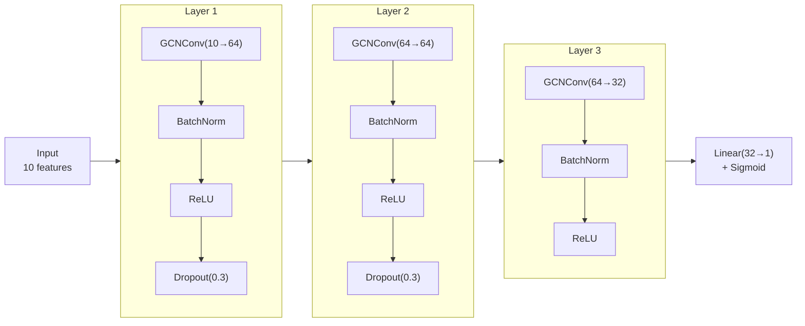

# Cascade Analysis Guide

**Complete reference for cascade failure analysis in Flux Operations Center.**

---

## Overview

The cascade analysis system identifies high-risk grid nodes ("Patient Zeros") that could trigger cascade failures and simulates failure propagation through the network.

**Key Capabilities:**
- Graph centrality metrics (betweenness, PageRank) via NetworkX
- BFS-based cascade simulation
- GNN-based risk prediction
- Cortex Agent integration for natural language queries
- Actionable analysis - Economic impact, mitigation playbooks, restoration sequencing

---

## Quick Start

### API Endpoints

```bash
# Get high-risk Patient Zero candidates
curl "http://localhost:3001/api/cascade/patient-zero-candidates?limit=10"

# Run cascade simulation
curl -X POST "http://localhost:3001/api/cascade/simulate-realtime" \
  -d "patient_zero_id=SUB-001" \
  -d "temperature_c=-10" \
  -d "load_multiplier=1.8" \
  -d "failure_threshold=0.15"

# Get scenario presets
curl "http://localhost:3001/api/cascade/scenarios"
```

### SQL Procedures

```sql
-- Get top 10 Patient Zero candidates
CALL <database>.CASCADE_ANALYSIS.GET_PATIENT_ZERO_CANDIDATES(10, TRUE);

-- Estimate impact for specific node
CALL <database>.CASCADE_ANALYSIS.ESTIMATE_CASCADE_IMPACT('SUB-001');

-- Get scenario recommendations
CALL <database>.CASCADE_ANALYSIS.GET_CASCADE_SCENARIO_RECOMMENDATIONS();
```

---

## Actionable Analysis

These endpoints transform cascade analysis from "technically impressive" to "actually useful for operators."

### 1. Economic Impact Calculator

**Endpoint**: `POST /api/cascade/economic-impact`

Converts cascade results into dollar impact:
- Regulatory penalties (compliance)
- Lost revenue (unserved energy)
- Restoration costs (crew, equipment)
- Severity tier assessment

```bash
# Calculate economic impact of a cascade
curl -X POST "http://localhost:3001/api/cascade/economic-impact" \
  -H "Content-Type: application/json" \
  -d '{"estimated_customers_affected": 64800, "affected_capacity_mw": 450, "total_affected_nodes": 87, "max_cascade_depth": 5, "cascade_order": [...]}'
```

**Example Response:**
```json
{
  "economic_impact": {
    "total_estimated_cost": 2847500.00,
    "breakdown": {
      "regulatory_penalties": {"subtotal": 1850000.00},
      "lost_revenue": {"subtotal": 145800.00},
      "restoration_costs": {"subtotal": 851700.00}
    }
  },
  "severity_assessment": {
    "tier": "CRITICAL",
    "description": "Regulatory investigation probable..."
  },
  "executive_summary": "$2,847,500 total exposure..."
}
```

### 2. Mitigation Playbook

**Endpoint**: `POST /api/cascade/mitigation-actions`

Generates actionable containment steps:
- Immediate actions (0-15 minutes)
- Choke point interventions
- Load transfer options
- Crew dispatch recommendations

```bash
curl -X POST "http://localhost:3001/api/cascade/mitigation-actions" \
  -H "Content-Type: application/json" \
  -d '{"patient_zero": {"node_id": "SUB-001", "node_name": "Main Substation"}, ...}'
```

**Example Response:**
```json
{
  "playbook": {
    "immediate_actions": [
      {"priority": 1, "action": "ISOLATE Main Substation", "time_target": "0-5 minutes"},
      {"priority": 2, "action": "ENABLE LOAD SHEDDING", "time_target": "5-10 minutes"}
    ],
    "choke_point_interventions": [...],
    "crew_dispatch": {
      "primary_location": {"node_name": "Main Substation", "lat": 30.05, "lon": -95.45},
      "estimated_crews_needed": 9
    },
    "containment_probability": {
      "with_immediate_action": 0.85,
      "with_15min_delay": 0.60
    }
  }
}
```

### 3. Restoration Sequence

**Endpoint**: `POST /api/cascade/restoration-sequence`

Optimal order to restore nodes after outage:
- Prioritizes customer-hours reduction
- Respects dependency constraints
- Provides milestone tracking

```bash
curl -X POST "http://localhost:3001/api/cascade/restoration-sequence" \
  -H "Content-Type: application/json" \
  -d '{"cascade_order": [...], "propagation_paths": [...]}'
```

### 4. Investment Comparison

**Endpoint**: `POST /api/cascade/compare-mitigations`

ROI analysis for grid hardening investments:
- Cost to harden each node
- Risk reduction achieved
- 5-year ROI calculation
- Budget-aware recommendations

### 5. Real-Time Risk Score

**Endpoint**: `GET /api/cascade/realtime-risk`

Current cascade risk based on live grid state:
- Load stress factor
- Peak hour factor
- Equipment stress
- Network vulnerability

---

## Key Metrics

### Betweenness Centrality
- **What it measures**: How often a node lies on shortest paths between other nodes
- **Range**: 0 to 1 (higher = more critical)
- **Interpretation**:
  - \> 0.5: CRITICAL BOTTLENECK
  - 0.1 - 0.5: HIGH importance
  - < 0.1: MODERATE importance

### Cascade Risk Score
- **Formula**: Weighted combination of betweenness, PageRank, and network reach
- **Range**: 0 to 1
- **Use**: Primary ranking metric for Patient Zero identification

### Network Reach
- **1-hop**: Direct neighbors (immediate impact)
- **2-hop**: Two degrees of separation
- **3-hop**: Three degrees of separation

---

## Predefined Scenarios

| Scenario | Temperature | Load | Threshold | Reference |
|----------|-------------|------|-----------|-----------|
| **Winter Storm** | -10°C | 1.8x | 0.15 | Extreme cold event |
| **Summer Peak** | 42°C | 1.6x | 0.20 | Heat wave |
| **Hurricane Event** | 28°C | 1.2x | 0.10 | Major storm |
| **Normal Operations** | 25°C | 1.0x | 0.35 | Baseline |

---

## Data Architecture

### Tables

| Table | Schema | Records | Description |
|-------|--------|---------|-------------|
| `GRID_NODES` | ML_DEMO | 91,829 | Grid topology nodes |
| `GRID_EDGES` | ML_DEMO | 2.5M | Node connections |
| `NODE_CENTRALITY_FEATURES_V2` | CASCADE_ANALYSIS | 1,873 | Precomputed centrality |
| `HIGH_RISK_PATIENT_ZEROS` | CASCADE_ANALYSIS | ~100 | Top risk candidates |
| `GNN_PREDICTIONS` | ML_DEMO | 91,829 | GNN risk predictions |

### Node Features

| Feature | Description |
|---------|-------------|
| CAPACITY_KW | Node capacity |
| VOLTAGE_KV | Operating voltage |
| CRITICALITY_SCORE | Base criticality |
| DOWNSTREAM_TRANSFORMERS | Count of downstream transformers |
| DEGREE_CENTRALITY | Number of connections |
| BETWEENNESS_CENTRALITY | Network bottleneck score |
| PAGERANK | Network importance |
| CASCADE_RISK_SCORE | Combined risk metric |

---

## Algorithm

### BFS Cascade Propagation

```python
# BFS via FastAPI endpoint
visited = {seed_idx}
queue = deque([(seed_idx, 0)])
while queue:
    current, depth = queue.popleft()
    if depth >= cascade_depth:
        continue
    cascade_labels[current] = 1
    for neighbor in adjacency.get(current, []):
        if neighbor not in visited:
            visited.add(neighbor)
            queue.append((neighbor, depth + 1))
```

### Customer Impact Formula

```
estimated_customers = downstream_transformers × 50
```

---

## ML Model

### GNN Architecture



### Performance
- **AUC-ROC**: 0.9988
- **Framework**: PyTorch Geometric
- **Training**: SPCS GPU (NVIDIA A10G)

---

## Troubleshooting

### No centrality data returned

```sql
-- Check if centrality table has data
SELECT COUNT(*) FROM <database>.CASCADE_ANALYSIS.NODE_CENTRALITY_FEATURES_V2;

-- If empty, run centrality computation script
-- backend/scripts/compute_graph_centrality.py
```

### Cascade simulation returns empty

```sql
-- Verify grid topology exists
SELECT COUNT(*) FROM <database>.ML_DEMO.GRID_NODES;
SELECT COUNT(*) FROM <database>.ML_DEMO.GRID_EDGES;
```

### Topology visualization shows 0 connections

See [POSTGRES_SYNC_RELIABILITY.md](./POSTGRES_SYNC_RELIABILITY.md) for Postgres sync troubleshooting.

---

## Files Reference

| File | Purpose |
|------|---------|
| `backend/server_fastapi.py` | API endpoints |
| `backend/scripts/compute_graph_centrality.py` | NetworkX centrality computation |
| `backend/scripts/cascade_simulator.py` | BFS simulation |
| `backend/scripts/train_gnn_model.py` | GNN training |
| `backend/sql/create_cascade_agent.sql` | Agent + procedures |

---

## Related Documentation

- [POSTGRES_SYNC_RELIABILITY.md](./POSTGRES_SYNC_RELIABILITY.md) - Topology data sync
- [LOCAL_DEVELOPMENT_GUIDE.md](./LOCAL_DEVELOPMENT_GUIDE.md) - Local dev setup
