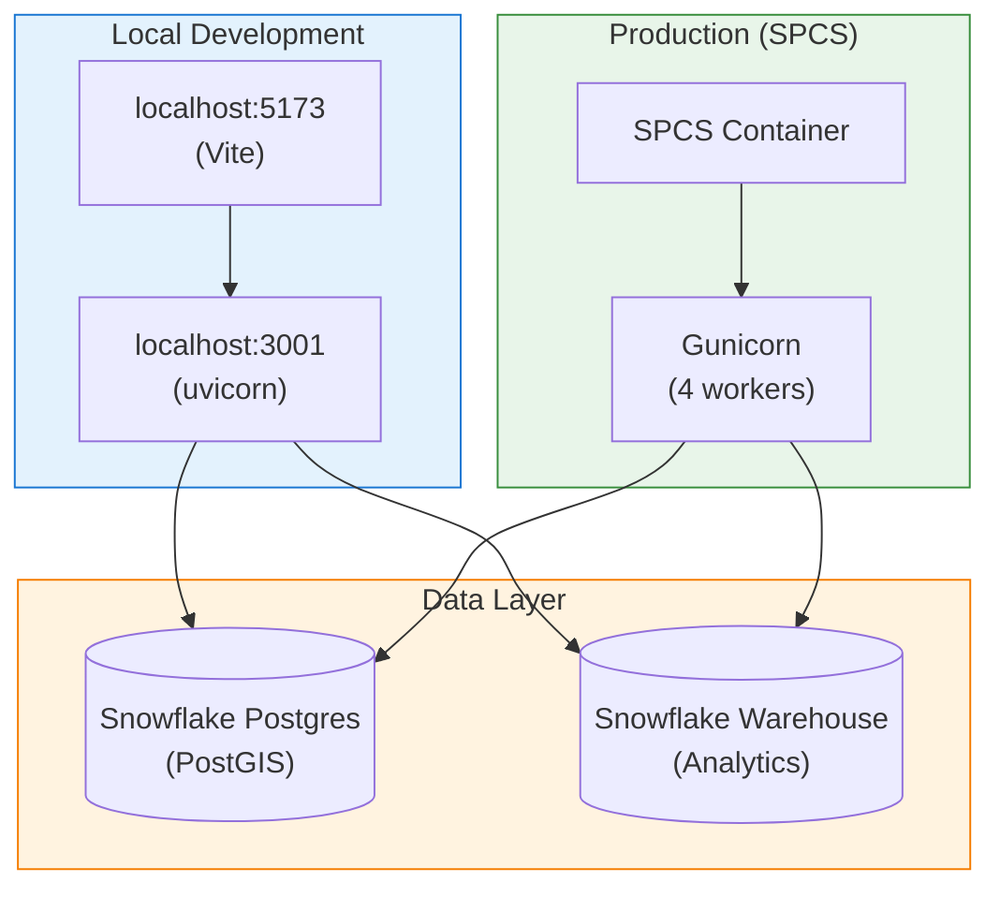

# Flux Operations Center - Local Development Guide

**The complete guide for local development setup and troubleshooting.**

---

## Table of Contents

1. [Quick Start](#quick-start)
2. [Prerequisites](#prerequisites)
3. [Authentication Setup](#authentication-setup)
4. [Starting the Servers](#starting-the-servers)
5. [Environment Variables](#environment-variables)
6. [Testing & Verification](#testing--verification)
7. [Troubleshooting](#troubleshooting)
8. [Architecture](#architecture)
9. [Quick Reference](#quick-reference)

---

## Quick Start

```bash
# Terminal 1 - Backend
cd flux_ops_center_spcs
SNOWFLAKE_CONNECTION_NAME=<your_connection> uvicorn backend.server_fastapi:app --host 0.0.0.0 --port 3001 --reload

# Terminal 2 - Frontend  
cd flux_ops_center_spcs
npm run dev
```

| Service | URL |
|---------|-----|
| Frontend | http://localhost:5173 |
| Backend API | http://localhost:3001 |
| API Docs (Swagger) | http://localhost:3001/docs |

---

## Prerequisites

- Python 3.11+
- Node.js 18+
- Snowflake CLI configured with a connection
- Personal Access Token (PAT) for Cortex Agent API

---

## Authentication Setup

### Why PAT is Required

The Snowflake Python connector session tokens (from password/key-pair auth) are **NOT valid** for REST API calls. The Cortex Agent REST API requires one of:

1. **JWT** (Key-Pair Authentication)
2. **OAuth Token** (OAuth flow)
3. **PAT** (Personal Access Token) ← **Recommended for local dev**

### Creating a Personal Access Token (PAT)

1. Log into Snowsight UI
2. Navigate to: **Admin** → **Users & Roles** → Click your username
3. Scroll to **Personal Access Tokens** section
4. Click **+ Token**
5. Name: `local_dev_flux_ops_center`
6. Expiration: Choose appropriate duration (recommend 90 days)
7. Click **Create Token**
8. **IMPORTANT:** Copy the token immediately (you won't see it again)

### Set Environment Variables

Add to `~/.zshrc` or `~/.bashrc`:

```bash
# Snowflake PAT for Cortex Agent API
export SNOWFLAKE_PAT='your_personal_access_token_here'
export SNOWFLAKE_HOST='<your_account>.snowflakecomputing.com'
```

Reload:
```bash
source ~/.zshrc
```

### SPCS vs Local Authentication

| Environment | Token Type | Source |
|-------------|------------|--------|
| **SPCS (Production)** | OAuth | Automatically provided at `/snowflake/session/token` |
| **Local Dev** | PAT | Environment variable `SNOWFLAKE_PAT` |

---

## Starting the Servers

### Option A: Two Terminal Windows (Recommended)

**Terminal 1 - Backend:**
```bash
cd flux_ops_center_spcs

# Install dependencies (first time only)
pip install -r backend/requirements.txt

# Start FastAPI server
SNOWFLAKE_CONNECTION_NAME=<your_connection> uvicorn backend.server_fastapi:app --host 0.0.0.0 --port 3001 --reload
```

**Terminal 2 - Frontend:**
```bash
cd flux_ops_center_spcs

# Install dependencies (first time only)
npm install

# Start Vite dev server
npm run dev
```

### Option B: Background Mode (Single Terminal)

```bash
cd flux_ops_center_spcs

# Start backend in background (survives terminal close)
nohup SNOWFLAKE_CONNECTION_NAME=<your_connection> uvicorn backend.server_fastapi:app --host 0.0.0.0 --port 3001 > /tmp/server.log 2>&1 & disown

# Monitor logs
tail -f /tmp/server.log

# Start frontend
npm run dev
```

---

## Environment Variables

Create or update `.env` in the project root (copy from `.env.template`):

```bash
# Snowflake Configuration
VITE_SNOWFLAKE_ACCOUNT_URL=https://<your_account>.<region>.snowflakecomputing.com

# Postgres Configuration (for map data caching)
VITE_POSTGRES_HOST=<your_postgres_instance>.postgres.snowflake.app
VITE_POSTGRES_PORT=5432
VITE_POSTGRES_DATABASE=postgres
VITE_POSTGRES_USER=<your_username>
VITE_POSTGRES_PASSWORD=<your_password>
```

**Security Note:** Never commit credentials to git. The `.env` file is in `.gitignore`.

---

## Testing & Verification

### 1. Check Backend Health
```bash
curl http://localhost:3001/
```

### 2. Test Cascade Analysis
```bash
# Patient Zero candidates
curl "http://localhost:3001/api/cascade/patient-zero-candidates?limit=5"

# Cascade simulation
curl -X POST "http://localhost:3001/api/cascade/simulate-realtime?patient_zero_id=SUB-001&scenario_name=Test&temperature_c=-10&load_multiplier=1.8&failure_threshold=0.15"
```

### 3. Test Spatial Endpoints
```bash
# Water bodies
curl "http://localhost:3001/api/spatial/layers/water-bodies?min_lon=-95.5&max_lon=-95.2&min_lat=29.7&max_lat=30.0&zoom=14"

# Vegetation risk
curl "http://localhost:3001/api/spatial/layers/vegetation?min_lon=-95.5&max_lon=-95.2&min_lat=29.7&max_lat=30.0"
```

### 4. Direct PostGIS Queries
```bash
export PGPASSWORD="<your_password>"
psql -h <your_postgres_host> -U <your_username> -d postgres
```

---

## Troubleshooting

### Backend won't start - "Address already in use"
```bash
lsof -i :3001
kill -9 <PID>
```

### Frontend can't connect to backend
```bash
curl http://localhost:3001/  # Verify backend is running
```

### Snowflake connection fails
```bash
snow connection test -c <your_connection>
echo $SNOWFLAKE_CONNECTION_NAME
```

### boto3 SSO Token Error
```
botocore.tokens | Loading cached SSO token for snowflake-sso
InvalidGrantException: Token has expired
```

**Cause:** `~/.aws/config` default profile uses SSO; boto3 tries to use expired tokens.

**Solution:** Already handled in `server_fastapi.py`. Verify these lines are at the top:
```python
import os
os.environ.setdefault('AWS_PROFILE', '')
os.environ.setdefault('AWS_SDK_LOAD_CONFIG', 'false')
os.environ.setdefault('AWS_CONFIG_FILE', '/dev/null')
```

### Topology Visualization Shows 0 Connections

**Cause:** Postgres sync left zombie connections causing data loss.

**Solution:**
```sql
CALL <your_database>.APPLICATIONS.CONFIGURE_POSTGRES_TIMEOUT();
CALL <your_database>.APPLICATIONS.SYNC_TOPOLOGY_TO_POSTGRES();
```

See [POSTGRES_SYNC_RELIABILITY.md](./POSTGRES_SYNC_RELIABILITY.md) for details.

### Cortex Agent returns 401/403
```bash
echo $SNOWFLAKE_PAT  # Verify PAT is set

# If expired, create new PAT in Snowsight:
# Admin → Users & Roles → Your User → Personal Access Tokens
```

### Agent returns 403 Forbidden (permissions)
```sql
GRANT USAGE ON AGENT <your_agent> TO USER <your_user>;
GRANT USAGE ON WAREHOUSE <your_warehouse> TO USER <your_user>;
```

---

## Architecture

### Local vs Production



Both environments use the **same dual-backend pattern**:
- **PostGIS** for fast spatial queries (water bodies, vegetation, topology)
- **Snowflake** for analytics queries (KPIs, historical data, AI/ML)

### Directory Structure

```
flux_ops_center_spcs/
├── backend/
│   ├── server_fastapi.py      # Main FastAPI server (port 3001)
│   ├── requirements.txt       # Python dependencies
│   ├── scripts/               # ML scripts (centrality, GNN)
│   └── sql/                   # Database setup scripts
├── src/                       # React frontend source
├── docs/                      # Documentation (you are here)
├── package.json               # Node.js dependencies
├── vite.config.ts             # Vite configuration
└── .env                       # Environment variables (not in git)
```

---

## Quick Reference

| Component | Command | URL |
|-----------|---------|-----|
| Backend | `SNOWFLAKE_CONNECTION_NAME=<conn> uvicorn backend.server_fastapi:app --port 3001 --reload` | http://localhost:3001 |
| Frontend | `npm run dev` | http://localhost:5173 |
| API Docs | (backend running) | http://localhost:3001/docs |

### Stopping Servers

```bash
# Frontend: Ctrl+C in terminal

# Backend: Ctrl+C, or if backgrounded:
lsof -i :3001
kill -9 <PID>
```

---

## Related Documentation

- [POSTGRES_SYNC_RELIABILITY.md](./POSTGRES_SYNC_RELIABILITY.md) - Snowflake→Postgres sync troubleshooting
- [CASCADE_ANALYSIS.md](./CASCADE_ANALYSIS.md) - Cascade analysis technical details
- [Snowflake PAT Docs](https://docs.snowflake.com/en/user-guide/programmatic-access-tokens)
- [Cortex Agent REST API](https://docs.snowflake.com/en/user-guide/snowflake-cortex/cortex-agents-rest-api)
