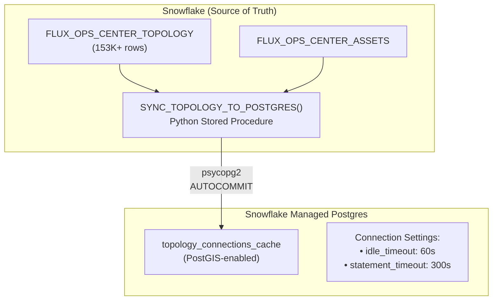

# Snowflake to Postgres Sync Architecture

## Overview

This document describes the architecture for syncing data from Snowflake (source of truth) to Snowflake Managed Postgres for PostGIS spatial queries.

---

## Architecture



---

## Sync Strategy

The sync uses a **cache-aside pattern** with two reliability mechanisms:

### Autocommit Mode

The `SYNC_TOPOLOGY_TO_POSTGRES()` procedure uses autocommit for predictable behavior:

```python
conn = psycopg2.connect(...)
conn.autocommit = True  # Each statement commits immediately
```

**Benefits**:
- Predictable commit behavior
- Atomic swap pattern (temp table → truncate → insert) for data consistency
- Suitable for cache tables that can be fully refreshed

### Connection Timeouts

Role-level settings ensure connections are cleaned up:

```sql
ALTER ROLE application SET idle_in_transaction_session_timeout = '60s';
ALTER ROLE application SET statement_timeout = '300s';
```

**Benefits**:
- Automatic cleanup of idle connections
- Prevents long-running queries from blocking resources
- Applies consistently to all application connections

---

## Snowflake Objects

### Stored Procedures

| Procedure | Schema | Purpose |
|-----------|--------|---------|
| `SYNC_TOPOLOGY_TO_POSTGRES()` | APPLICATIONS | Main sync procedure |
| `SYNC_VEGETATION_TO_POSTGRES()` | APPLICATIONS | Vegetation data sync |
| `SYNC_TRANSFORMERS_TO_POSTGRES()` | APPLICATIONS | Transformer data sync |
| `CONFIGURE_POSTGRES_TIMEOUT()` | APPLICATIONS | Configure/verify PG settings |

### Tasks

| Task | Schedule | Purpose |
|------|----------|---------|
| `TASK_SYNC_TOPOLOGY_DAILY` | 4 AM | Daily full refresh |
| `TASK_SYNC_TOPOLOGY_ON_CHANGE` | Every minute (when stream has data) | Incremental sync |

### Secrets & Integrations

| Object | Type | Purpose |
|--------|------|---------|
| `POSTGRES_CREDENTIALS` | Secret | Username/password for Postgres |
| `FLUX_POSTGRES_INTEGRATION` | External Access Integration | Network access to Postgres |

---

## Operations

### Verify Sync Status

```sql
-- Check Postgres settings and row counts
CALL <database>.APPLICATIONS.CONFIGURE_POSTGRES_TIMEOUT();

-- Expected output:
-- {
--   "status": "success",
--   "results": [
--     "idle_in_transaction_session_timeout = 60s",
--     "statement_timeout = 300s",
--     "topology_connections_cache row count: 153592"
--   ]
-- }
```

### Manual Sync

```sql
-- Run a full sync manually
CALL <database>.APPLICATIONS.SYNC_TOPOLOGY_TO_POSTGRES();

-- Expected output:
-- {
--   "status": "success",
--   "rows_synced": 153592,
--   "final_count": 153592
-- }
```

### Check Task History

```sql
SELECT *
FROM TABLE(INFORMATION_SCHEMA.TASK_HISTORY(
    TASK_NAME => 'TASK_SYNC_TOPOLOGY_DAILY',
    SCHEDULED_TIME_RANGE_START => DATEADD('day', -7, CURRENT_TIMESTAMP())
))
ORDER BY SCHEDULED_TIME DESC;
```

---

## Design Notes

### Why Snowflake → Postgres?

PostGIS provides specialized spatial operations (ST_DWithin, spatial indexes) that complement Snowflake's analytics capabilities. This architecture uses each database for its strengths:

- **Snowflake**: Source of truth, analytics, ML/AI
- **Postgres**: Fast spatial queries for map visualization

### OpenFlow Consideration

OpenFlow CDC currently supports Postgres → Snowflake direction. For Snowflake → Postgres sync, we use scheduled stored procedures with the patterns described above.

---

## Related Documentation

- [LOCAL_DEVELOPMENT_GUIDE.md](./LOCAL_DEVELOPMENT_GUIDE.md) - Local dev setup
- [CASCADE_ANALYSIS.md](./CASCADE_ANALYSIS.md) - Cascade analysis tools
- [Snowflake External Network Access](https://docs.snowflake.com/en/developer-guide/external-network-access/external-network-access-best-practices)
