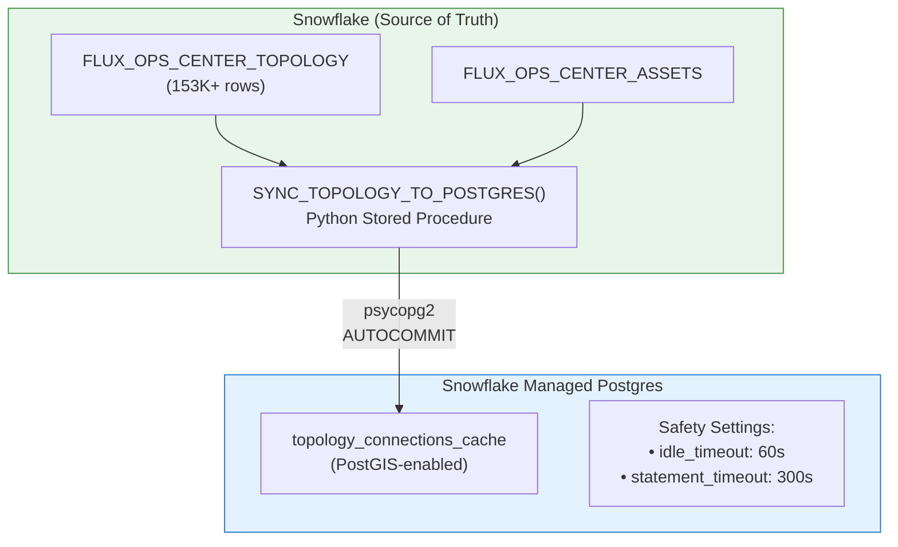

# Snowflake to Postgres Sync Reliability

## Overview

This document describes the architecture and reliability mechanisms for syncing data from Snowflake (source of truth) to Snowflake Managed Postgres (for PostGIS spatial queries).

---

## Architecture



---

## Problem: Zombie Connections

### Root Cause

Snowflake's Python runtime for stored procedures doesn't always properly release psycopg2 connections. This can leave connections in an "idle in transaction" state, which:

1. Holds locks on tables
2. Prevents subsequent operations from seeing committed data
3. Can cause TRUNCATE to commit but INSERT to remain uncommitted

### Symptoms

- `topology_connections_cache` shows 0 rows despite procedure reporting success
- PostgreSQL `pg_stat_activity` shows connections with `state = 'idle in transaction'`
- Topology visualization in the UI fails to load

---

## Solution: Defense in Depth

We implemented two layers of protection:

### Layer 1: Autocommit Mode in Procedure

The `SYNC_TOPOLOGY_TO_POSTGRES()` procedure now uses `conn.autocommit = True`:

```python
conn = psycopg2.connect(...)
conn.autocommit = True  # CRITICAL: Prevents transaction state issues
```

**Benefits**:
- Each statement commits immediately
- No transaction state can get stuck
- Uses atomic swap pattern (temp table → truncate → insert) for data consistency

**Trade-off**:
- Cannot rollback partial failures
- Acceptable for a cache table that can be re-synced

### Layer 2: PostgreSQL Timeout Safety Net

Role-level settings on the `application` user:

```sql
ALTER ROLE application SET idle_in_transaction_session_timeout = '60s';
ALTER ROLE application SET statement_timeout = '300s';
```

**Benefits**:
- Auto-terminates any connection idle in transaction for >60 seconds
- Prevents runaway queries with 5-minute statement timeout
- Applies to all new connections from the `application` user

---

## Snowflake Objects

### Stored Procedures

| Procedure | Schema | Purpose |
|-----------|--------|---------|
| `SYNC_TOPOLOGY_TO_POSTGRES()` | APPLICATIONS | Main sync procedure |
| `SYNC_VEGETATION_TO_POSTGRES()` | APPLICATIONS | Vegetation data sync |
| `SYNC_TRANSFORMERS_TO_POSTGRES()` | APPLICATIONS | Transformer data sync |
| `CONFIGURE_POSTGRES_TIMEOUT()` | APPLICATIONS | Configure/verify PG settings |

### Tasks

| Task | Schedule | Purpose |
|------|----------|---------|
| `TASK_SYNC_TOPOLOGY_DAILY` | 4 AM | Daily full refresh |
| `TASK_SYNC_TOPOLOGY_ON_CHANGE` | Every minute (when stream has data) | Incremental sync |

### Secrets & Integrations

| Object | Type | Purpose |
|--------|------|---------|
| `POSTGRES_CREDENTIALS` | Secret | Username/password for Postgres |
| `FLUX_POSTGRES_INTEGRATION` | External Access Integration | Network access to Postgres |

---

## Verification & Troubleshooting

### Check Current Status

```sql
-- Verify Postgres settings and check for zombie connections
CALL <database>.APPLICATIONS.CONFIGURE_POSTGRES_TIMEOUT();

-- Expected output:
-- {
--   "status": "success",
--   "results": [
--     "idle_in_transaction_session_timeout = 60s",
--     "statement_timeout = 300s",
--     "Current idle in transaction connections: 0",
--     "topology_connections_cache row count: 153592"
--   ]
-- }
```

### Manual Sync

```sql
-- Run a full sync manually
CALL <database>.APPLICATIONS.SYNC_TOPOLOGY_TO_POSTGRES();

-- Expected output:
-- {
--   "status": "success",
--   "rows_synced": 153592,
--   "final_count": 153592
-- }
```

### Check Task Status

```sql
-- View task run history
SELECT *
FROM TABLE(INFORMATION_SCHEMA.TASK_HISTORY(
    TASK_NAME => 'TASK_SYNC_TOPOLOGY_DAILY',
    SCHEDULED_TIME_RANGE_START => DATEADD('day', -7, CURRENT_TIMESTAMP())
))
ORDER BY SCHEDULED_TIME DESC;
```

---

## Why Not OpenFlow CDC?

We investigated using OpenFlow for CDC but found it's not applicable:

- **OpenFlow CDC direction**: Postgres → Snowflake (captures changes FROM Postgres)
- **Our use case**: Snowflake → Postgres (sync TO Postgres for PostGIS)

OpenFlow would be useful if we reversed the data flow (made Postgres the source of truth), but that would require significant architectural changes.

---

## Future Considerations

1. **Snowflake Native Spatial**: If Snowflake adds native PostGIS-equivalent support, we could eliminate the Postgres dependency entirely.

2. **SPCS Service**: For more complex sync patterns, consider moving the sync logic to a Snowpark Container Service with proper connection pooling.

3. **OpenFlow Reverse**: Monitor if Snowflake adds Snowflake→Postgres CDC support in OpenFlow.

---

## Related Documentation

- [LOCAL_DEVELOPMENT_GUIDE.md](./LOCAL_DEVELOPMENT_GUIDE.md) - Local dev setup
- [CASCADE_ANALYSIS.md](./CASCADE_ANALYSIS.md) - Cascade analysis tools
- [Snowflake External Network Access Best Practices](https://docs.snowflake.com/en/developer-guide/external-network-access/external-network-access-best-practices)
