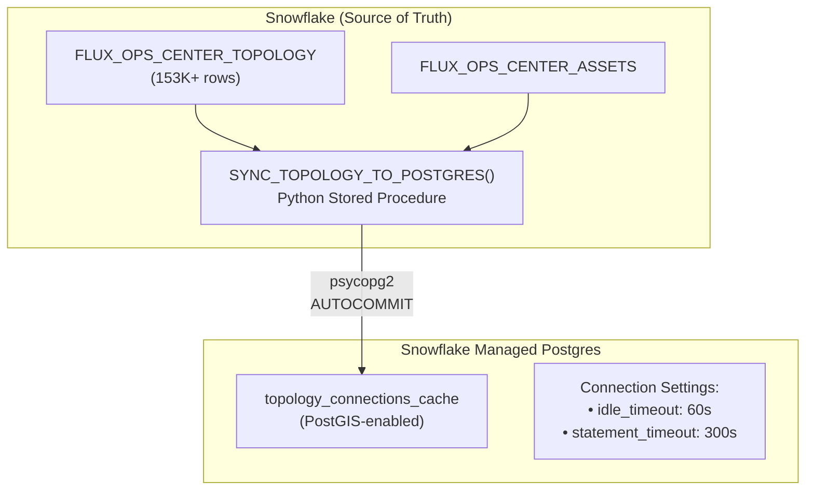

# Snowflake to Postgres Sync Architecture

> **Document Version**: February 2026
>
> This document reflects design decisions made based on Snowflake Postgres (public preview) capabilities available at the time of writing. As Snowflake Postgres and related features (OpenFlow, CDC, etc.) evolve, the patterns and recommendations described here may change. Always consult the latest [Snowflake documentation](https://docs.snowflake.com/) for current best practices.

## Overview

This document describes the architecture for syncing data from Snowflake (source of truth) to Snowflake Managed Postgres for PostGIS spatial queries.

---

## Postgres Instances

| Instance | Host | Purpose | Version |
|----------|------|---------|---------|
| `FLUX_OPERATIONS_POSTGRES` | `mthi2s7canh3xpfhyzdhuuj7pu...snowflake.app` | **Production** | PG 17 |
| `FLUX_OPS_POSTGRES_TEST` | `bnubb2dxdreifnzikupmf2vpmq...snowflake.app` | Testing/Development | PG 18 |

---

## Production Data Validation (Feb 2026)

| Layer | Snowflake Source | Prod Postgres Table | Rows | Status |
|-------|------------------|---------------------|------|--------|
| Substations | `SUBSTATIONS` | `substations` | 275 | ✅ Match |
| Transformers | `TRANSFORMER_METADATA` | `transformers` | 91,554 | ✅ Match |
| Power Lines | `GRID_POWER_LINES` | `grid_power_lines` | 13,104 | ✅ Match |
| Buildings | `HOUSTON_BUILDINGS_CLEAN` | `building_footprints` | 2,670,707 | ✅ Match |
| Water Bodies | `HOUSTON_WATER_BODIES` | `osm_water` | 12,758 | ✅ Synced |
| Vegetation | `VEGETATION_POWER_LINE_RISK` | `vegetation_risk` | 49,265 | ✅ Synced |
| Meters | `METER_INFRASTRUCTURE` | `meter_locations_enhanced` | 100,000 | ✅ Subset |
| Customers | N/A | `customers_spatial` | 100,000 | ✅ Synced |

---

## Architecture



---

## Sync Strategy

The sync uses a **cache-aside pattern** with two reliability mechanisms:

### Autocommit Mode

The `SYNC_TOPOLOGY_TO_POSTGRES()` procedure uses autocommit for predictable behavior:

```python
conn = psycopg2.connect(...)
conn.autocommit = True  # Each statement commits immediately
```

**Benefits**:
- Predictable commit behavior
- Atomic swap pattern (temp table → truncate → insert) for data consistency
- Suitable for cache tables that can be fully refreshed

### Connection Timeouts

Role-level settings ensure connections are cleaned up:

```sql
ALTER ROLE application SET idle_in_transaction_session_timeout = '60s';
ALTER ROLE application SET statement_timeout = '300s';
```

**Benefits**:
- Automatic cleanup of idle connections
- Prevents long-running queries from blocking resources
- Applies consistently to all application connections

---

## Snowflake Objects

### Stored Procedures

| Procedure | Schema | Purpose |
|-----------|--------|---------|
| `SYNC_TOPOLOGY_TO_POSTGRES()` | APPLICATIONS | Main sync procedure |
| `SYNC_VEGETATION_TO_POSTGRES()` | APPLICATIONS | Vegetation data sync |
| `SYNC_TRANSFORMERS_TO_POSTGRES()` | APPLICATIONS | Transformer data sync |
| `CONFIGURE_POSTGRES_TIMEOUT()` | APPLICATIONS | Configure/verify PG settings |

### Tasks

| Task | Schedule | Purpose |
|------|----------|---------|
| `TASK_SYNC_TOPOLOGY_DAILY` | 4 AM | Daily full refresh |
| `TASK_SYNC_TOPOLOGY_ON_CHANGE` | Every minute (when stream has data) | Incremental sync |

### Secrets & Integrations

| Object | Type | Purpose |
|--------|------|---------|
| `POSTGRES_CREDENTIALS` | Secret (PASSWORD) | Production Postgres credentials |
| `POSTGRES_TEST_CREDENTIALS` | Secret (PASSWORD) | Test Postgres credentials |
| `FLUX_POSTGRES_INTEGRATION` | External Access Integration | Network access to production Postgres |
| `FLUX_POSTGRES_TEST_INTEGRATION` | External Access Integration | Network access to test Postgres |

---

## Connectivity Setup

### Network Policy Configuration

**Critical**: Network policies must be explicitly attached to Postgres instances:

```sql
-- Create network rule for Snowflake egress
CREATE OR REPLACE NETWORK RULE FLUX_DB.PUBLIC.FLUX_POSTGRES_TEST_NETWORK_RULE
  TYPE = HOST_PORT
  MODE = EGRESS
  VALUE_LIST = ('bnubb2dxdreifnzikupmf2vpmq...snowflake.app:5432');

-- Create external access integration for stored procedures
CREATE OR REPLACE EXTERNAL ACCESS INTEGRATION FLUX_POSTGRES_TEST_INTEGRATION
  ALLOWED_NETWORK_RULES = (FLUX_DB.PUBLIC.FLUX_POSTGRES_TEST_NETWORK_RULE)
  ALLOWED_AUTHENTICATION_SECRETS = (FLUX_DB.APPLICATIONS.POSTGRES_TEST_CREDENTIALS)
  ENABLED = TRUE;

-- Create network rule for ingress (local machine access)
CREATE OR REPLACE NETWORK RULE FLUX_DB.PUBLIC.FLUX_OPS_POSTGRES_TEST_INGRESS_RULE
  TYPE = IPV4
  MODE = INGRESS
  VALUE_LIST = ('0.0.0.0/0');  -- Use specific IPs in production

-- Create network policy
CREATE OR REPLACE NETWORK POLICY FLUX_OPS_POSTGRES_TEST_NETWORK_POLICY
  ALLOWED_NETWORK_RULE_LIST = (FLUX_DB.PUBLIC.FLUX_OPS_POSTGRES_TEST_INGRESS_RULE);

-- CRITICAL: Attach policy to instance (often forgotten!)
ALTER POSTGRES INSTANCE FLUX_OPS_POSTGRES_TEST 
  SET NETWORK_POLICY = FLUX_OPS_POSTGRES_TEST_NETWORK_POLICY;
```

### Local Machine Connection

Add to `~/.pg_service.conf`:

```ini
[flux_ops_postgres_prod]
host=<your-postgres-instance-id>.us-west-2.aws.postgres.snowflake.app
port=5432
dbname=postgres
user=snowflake_admin
sslmode=require

[flux_ops_postgres_test]
host=<your-postgres-instance-id>.us-west-2.aws.postgres.snowflake.app
port=5432
dbname=postgres
user=snowflake_admin
sslmode=require
```

Test connection:
```bash
PGPASSWORD='<your_password>' PGSERVICE=flux_ops_postgres_prod psql -c "SELECT 1"
```

### Stored Procedure Secret Access

For PASSWORD type secrets, use `_snowflake.get_username_password()`:

```python
import _snowflake

def my_sync_procedure(session):
    creds = _snowflake.get_username_password('pg_creds')
    conn = psycopg2.connect(
        host='...',
        user=creds.username,
        password=creds.password,
        ...
    )
```

**Common mistake**: Using `get_generic_secret_string()` for PASSWORD secrets - this will fail!

---

## Operations

### Verify Sync Status

```sql
-- Check Postgres settings and row counts
CALL <database>.APPLICATIONS.CONFIGURE_POSTGRES_TIMEOUT();

-- Expected output:
-- {
--   "status": "success",
--   "results": [
--     "idle_in_transaction_session_timeout = 60s",
--     "statement_timeout = 300s",
--     "topology_connections_cache row count: 153592"
--   ]
-- }
```

### Manual Sync

```sql
-- Run a full sync manually
CALL <database>.APPLICATIONS.SYNC_TOPOLOGY_TO_POSTGRES();

-- Expected output:
-- {
--   "status": "success",
--   "rows_synced": 153592,
--   "final_count": 153592
-- }
```

### Check Task History

```sql
SELECT *
FROM TABLE(INFORMATION_SCHEMA.TASK_HISTORY(
    TASK_NAME => 'TASK_SYNC_TOPOLOGY_DAILY',
    SCHEDULED_TIME_RANGE_START => DATEADD('day', -7, CURRENT_TIMESTAMP())
))
ORDER BY SCHEDULED_TIME DESC;
```

---

## Design Notes

### Why Snowflake → Postgres?

PostGIS provides specialized spatial operations (ST_DWithin, spatial indexes) that complement Snowflake's analytics capabilities. This architecture uses each database for its strengths:

- **Snowflake**: Source of truth, analytics, ML/AI
- **Postgres**: Fast spatial queries for map visualization

### OpenFlow Consideration

OpenFlow CDC currently supports Postgres → Snowflake direction. For Snowflake → Postgres sync, we use scheduled stored procedures with the patterns described above.

---

## Related Documentation

- [LOCAL_DEVELOPMENT_GUIDE.md](./LOCAL_DEVELOPMENT_GUIDE.md) - Local dev setup
- [CASCADE_ANALYSIS.md](./CASCADE_ANALYSIS.md) - Cascade analysis tools
- [Snowflake External Network Access](https://docs.snowflake.com/en/developer-guide/external-network-access/external-network-access-best-practices)
