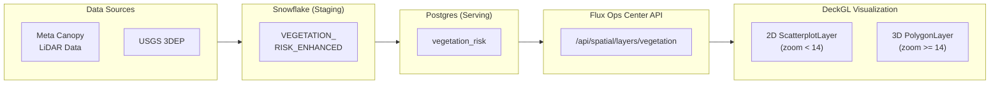

# Vegetation Risk Analysis - Architecture & Production Path

> **Document Version**: January 2025
>
> This architecture uses [Snowflake Postgres](https://docs.snowflake.com/en/user-guide/postgres/overview) (public preview) with PostGIS for spatial serving. As Snowflake Postgres evolves, the serving layer patterns may change.

## Overview

The Flux Operations Center includes a 3D vegetation risk visualization system with real tree heights, risk scores, and proximity analysis. This document describes the architecture, data sources, and production deployment path.

## Data Architecture



## Data Sources

### Current Implementation (Demo)

**Synthetic Data** - 50,000 trees with realistic distributions
- Generated using urban center weights
- Height distribution: 3m - 35m (mean: 13.7m)
- Species: Common regional trees
- Risk computed from simulated proximity to power lines

### Production Options (Recommended Order)

1. **Meta/WRI Global Canopy Height** (Immediate - Free)
   - Source: `s3://dataforgood-fb-data/forests/v1/alsgedi_global_v6_float/`
   - Resolution: 1-meter AI-derived tree heights
   - License: CC BY 4.0 (commercial use allowed)
   - Coverage: Global

2. **USGS 3DEP LiDAR** (Short-term - Free)
   - Source: `s3://usgs-lidar-public/`
   - Resolution: Sub-meter point cloud
   - Coverage: Most US metro areas have excellent coverage
   - Format: LAZ/LAS files

3. **Utility LiDAR Data** (Production - Best)
   - Utility's own transmission line LiDAR surveys
   - Highest accuracy for vegetation near infrastructure
   - Already collected as part of transmission maintenance

## Snowflake Schema

```sql
CREATE TABLE <database>.APPLICATIONS.VEGETATION_RISK_ENHANCED (
    tree_id VARCHAR(100) PRIMARY KEY,
    longitude FLOAT NOT NULL,
    latitude FLOAT NOT NULL,
    height_m FLOAT,                    -- Tree height in meters
    canopy_radius_m FLOAT,             -- Estimated canopy spread
    species VARCHAR(100),              -- Tree species if known
    tree_class VARCHAR(50),            -- small_tree, medium_tree, large_tree
    risk_score FLOAT,                  -- 0.0-1.0 overall risk
    risk_level VARCHAR(20),            -- critical, warning, monitor, safe
    distance_to_line_m FLOAT,          -- Distance to nearest power line
    nearest_line_id VARCHAR(100),      -- ID of nearest power line
    nearest_line_voltage_kv FLOAT,     -- Voltage level
    minimum_clearance_m FLOAT,         -- Required clearance
    clearance_deficit_m FLOAT,         -- How much tree exceeds clearance
    estimated_annual_growth_m FLOAT,   -- Growth rate
    years_to_encroachment FLOAT,       -- Prediction
    data_source VARCHAR(100),          -- 'meta_canopy_2020', 'lidar_2024'
    source_date DATE,
    geom GEOGRAPHY
);
```

## Risk Calculation

Based on utility vegetation management standards:

```
Voltage (kV)  | Required Clearance (m)
--------------+-----------------------
765           | 10.7
500           | 7.6
345           | 6.1
230           | 5.5
138           | 4.6
69            | 3.8
34.5          | 3.0
12.47         | 2.4 (Distribution)
4.16          | 2.0
```

**Risk Score Formula:**
```python
fall_zone = height_m * 1.1  # 110% safety factor
effective_distance = distance_to_line_m - canopy_radius_m
proximity_risk = max(0, 1 - (effective_distance / (fall_zone + clearance_required)))
height_risk = min(1, height_m / 30)
risk_score = (proximity_risk * 0.7) + (height_risk * 0.3)
```

**Risk Levels:**
- **Critical** (>0.8): Immediate attention required
- **Warning** (0.6-0.8): High priority trimming needed
- **Monitor** (0.35-0.6): Schedule routine maintenance
- **Safe** (<0.35): No action required

## Visualization

### 2D View (Zoom < 14)
- Fast ScatterplotLayer markers
- Size based on tree height
- Color based on risk level:
  - Red: Critical
  - Orange: Warning
  - Amber: Monitor
  - Green: Safe
- Glow effect for high-risk trees

### 3D View (Zoom >= 14)
- Extruded PolygonLayer cylinders
- **Height shows actual tree height**
- Octagonal cross-section for tree trunks
- Canopy layer sits on top of trunk
- Same risk-based coloring

## API Endpoints

**GET /api/spatial/layers/vegetation**

Parameters:
- `min_lon`, `max_lon`, `min_lat`, `max_lat` - Viewport bounds
- `limit` - Maximum trees to return (default: 50000)

Response:
```json
{
  "type": "vegetation",
  "features": [...],
  "count": 50000,
  "risk_summary": {
    "critical": 1528,
    "warning": 2535,
    "monitor": 4961,
    "safe": 40976
  },
  "postgis_analysis": true,
  "cache_hit": true
}
```

## Production Deployment Path

### Phase 1: Demo (Current)
- Synthetic data with realistic distributions
- 50,000 trees for metro area
- Full risk calculation pipeline
- 3D visualization

### Phase 2: Meta Canopy Integration
- [ ] Download area tiles from Meta S3
- [ ] Process with rasterio to extract tree points
- [ ] Load to Snowflake with proximity analysis
- [ ] Runtime: ~2-4 hours

### Phase 3: USGS LiDAR Enhancement
- [ ] Identify priority transmission corridors
- [ ] Download relevant LAZ tiles
- [ ] Process with Potree/loaders.gl
- [ ] Higher accuracy for critical areas

### Phase 4: Production Data Integration
- [ ] Receive utility LiDAR data exports
- [ ] Process through same pipeline
- [ ] Merge with satellite-derived heights
- [ ] Establish refresh cadence

## Files Modified

- `backend/scripts/process_meta_canopy.py` - Data processing pipeline
- `backend/load_spatial_data_to_postgres.py` - Enhanced Postgres loader
- `backend/server_fastapi.py` - API cache preload with heights
- `src/App.tsx` - 3D visualization layer
- `src/types/index.ts` - Type definitions
